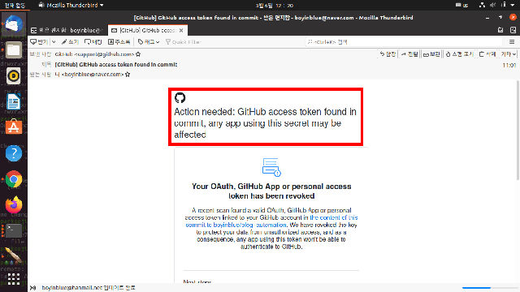
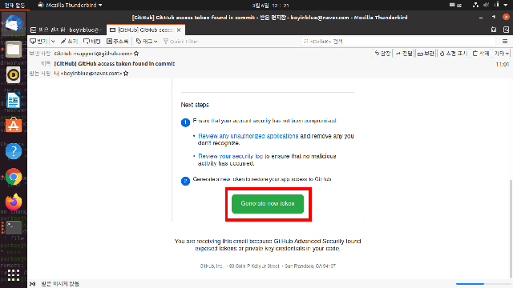

[GitHub] API 호출시 Bad Credentials 에러 발생시 조치 방법
===
   
본 페이지에서는 GitHub API 호출시에 "Bad credentials" 응답이 오는 문제를 해결하는 방법을 기술하고자 합니다. 
GitHub와 Jenkins를 연동하여 자동화 시스템을 구축한 개발자라면 Jenkins 구동 중에 GitHub API를 통하여 다양한 고급 기능을 구사할 수 있습니다. 
Jenkins 수행 결과를 Pull Request에 레이블로 달거나 코멘트를 자동으로 남기는 등의 작업을 자동으로 수행할 수 있습니다.   
   
GitHub API를 이용하려면 당연히 인증 과정이 필요합니다. 
API를 통해서 사용할 수 있는 기능은 무궁무진하고 엑세스 자격이 없는 사용자가 레포지토리를 망치는 불상사를 방지해야 합니다. 
이를 위해 API를 통해 엑세스하기 위해서는 인증 과정이 필요하고, 주로 토큰(token)을 사용하게 됩니다.    
   
현재까지 GitHub API의 "bad credenials" 문제를 여러번 경험하였고, 크게 4가지 원인으로 분류할 수 있습니다.   
1. 올바르지 않은 GitHub 토큰을 사용한 경우 
2. 토큰이 생성한 후 일정한 기간이 경과하여 토큰이 폐기된 경우 
3. *토큰이 노출되어 GitHub에서 자동적으로 폐기된 경우* 
4. [GitHub 프로그램을 이용하여 API 통신시 토큰 오류 해결방법 (링크)](https://frankler.tistory.com/52 "GitHub 프로그램을 이용하여 API 통신시 토큰 오류 해결방법")
   
본 페이지에서는 위의 3번 사례에 대해서만 다루고자 합니다.   
   
문제의 상황
---

<pre><code>
cat tmp/list.json | \
curl \
  -u ${id}:${token} \
  -X PATCH \
  -H "Accept: application/vnd.github.v3+json" \
  --data-binary @- \
  https://api.github.com/repos/boyinblue/blog_automation/issues/1
</code></pre>
   
위의 bash 스크립트는 *tmp/list.json* 파일의 내용으로 이슈 리스트의 내용을 update하는 코드입니다. 위의 스크립트를 수행한 결과는 아래와 같습니다.   

<pre><code>
$ ./update_to_github.sh 
{
  "message": "Bad credentials",
  "documentation_url": "https://docs.github.com/rest"
}
</code></pre>

기존에는 잘 동작하던 GitHub API 스크립트가 갑자기 "Bad credentials" 응답을 보내왔습니다. 
토큰을 생성한지 하루밖에 되지 않았기 때문에 토큰의 유효기간이 지난 경우는 아닌 것 같았습니다. 
갑자기 꺼림칙한 생각이 들었습니다. 
최근에 GitHub에 업데이트한 스크립트에 토큰값이 포함되어 있었던 것입니다.   
   
   
   
메일함을 살펴봤더니 친절하게도 GitHub로부터 위와 같은 메일이 수신되었습니다. 
제 실수로 토큰값을 GitHub에 커밋하여 토큰값이 누출되었고, 보안상의 이유로 GitHub에서 유출된 해당 토큰을 자동으로 폐기했던 것입니다. 
그리고 친절하게 저에게 메일로 알려주었네요. 
누구나 실수를 할 수 있고, 그런 실수마저도 즉각적으로 조치해주는 GitHub의 시스템이 참 놀랍더군요. 

문제 해결 방법 
---
   
GitHub는 친절하게도 아래와 같이 메일 아래쪽에 토큰을 재발급할 수 있는 링크까지 포함시켜 놓았습니다.   

   
해당 문제를 해결하는 방법은 아주 간단합니다. 
"Generate New Token" 버튼을 선택하여 토큰을 재발급하시면 됩니다. 
   
토큰이 유출되는 문제를 방지하기 위한 방법 
---
   
토큰이 유출되지 않도록 방지하는 몇가지 방법이 있습니다.   
1. 로컬 영역에 토큰값을 저장할 경우 권한을 0600으로 부여합니다. 
2. 토큰값을 저장한 파일이 커밋되는 일이 없도록 .gitignore 파일에 토큰값이 저장된 파일을 추가합니다. 

이상입니다.   
