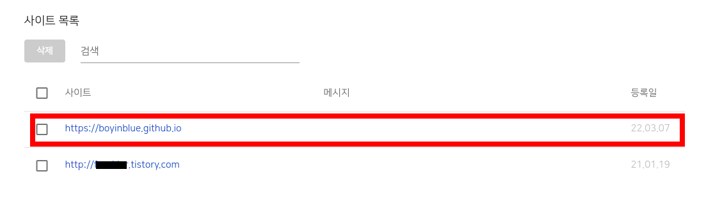

[GitHub 블로그] 네이버 서치 어드바이저에 등록 방법 (네이버 웹마스터 도구에 사이트 추가 방법)
===
   

지난번에는 [GitHub 블로그의 장점과 무료로 개설하는 방법](https://boyinblue.github.io/002_github_blog/001_advantage_of_github_blog.html "GitHub 블로그의 장점과 무료로 개설하는 방법")에 대해서 기술하였습니다. 
또한, [GitHub 블로그를 구글 서치 콘솔에 등록하는 방법](https://boyinblue.github.io/002_github_blog/002_google_search_console_apply.html "GitHub 블로그를 구글 서치 콘솔에 등록하는 방법")에 대해서도 설명드렸습니다.   
   

이번에는 [네이버 서치 어드바이저](https://searchadvisor.naver.com/console/board "네이버 서치 어드바이저")에 GitHub Pages를 등록하는 방법에 대해서 기술하고자 합니다. 
블로그를 개설하였다면 최대한 많은 사용자가 검색해서 방문할 수 있도록 하는게 좋겠지요? 
더 많은 방문자는 곧 더 많은 수익을 의미하기 때문입니다.   
   

GitHub Pages를 생성했다면 여러 검색 엔진에 등록하여 검색 엔진에 의한 유입을 최대한 늘리는게 좋습니다. 
구글 서치 콘솔에 등록하는 것은 기본이고, 모국어인 한글을 주로 사용하여 블로그를 작성하기 시작했다면 네이버 서치 어드바이저도 등록하는게 좋습니다.   
   

네이버 서치 어드바이저에 GitHub 블로그 추가 방법
---
   

지난 시간에 구글 서치 콘솔에 GitHub Pages를 등록하는 방법은 아주 쉬웠습니다. 
GitHub 블로그의 root 디렉토리에 특정 html을 업로드하는 방법으로 아주 간단하게 사이트의 소유권을 확인하였습니다. 
   

### Step 1. 네이버 서치 어드바이저 접속
   

우선 [네이버 서치 어드바이저](https://searchadvisor.naver.com/console/board "네이버 서치 어드바이저")에 접속합니다. 
사이트는 최대 100개까지 등록이 가능합니다.   
   

### Step 2. 등록할 사이트 URL을 추가
   

추가할 사이트에 https://boyinblue.github.io 형식의 URL을 입력합니다. 
제 아이디인 boyinblue 대신에 여러분들이 생성한 GitHub 아이디로 치환해서 입력하시면 됩니다. 
등록할 사이트가 URL에 추가되었다면 "소유확인 진행" 버튼을 눌러서 다음 단계로 이동합니다.   
   

### Step 3. naverXXXXXX.html 형식의 파일을 GitHub 블로그에 업로드
   

네이버 서치 어드바이저에 GitHub 블로그의 소유권 확인은 구글 서치 콘솔에 등록했던 것처럼 html 파일을 업로드하면 됩니다. 
naverXXXXXXXXXX.html 파일을 GitHub 블로그의 최상위 디렉토리에 올려주기만 하면 됩니다. 
해당 파일은 32바이트짜리 토큰값이 파일명에 포함되어 있고, 파일 이름과 파일 내용이 일치합니다. 
이렇게 네이버 서치 어드바이저 페이지에서 다운로드한 특정 파일을 GitHub Pages에 업로드하는 방법으로 사이트가 내 소유임을 증명하였습니다. 

   
### Step 4. 사이트 소유 확인 완료
   

업로드한 파일에 접속되는 것을 확인하였다면 아래 사진과 같이 네이버 서치 어드바이저에 등록 완료된 것입니다. 
   

   

네이버 서치 어드바이저에 등록 완료되었다고해서 네이버 검색 엔진에 노출된다는 보장은 없지만 
양질의 컨텐츠를 지속적으로 제공하면 네이버 검색 엔진에 제 글이 검색되기 시작하고 자연스럽게 방문자수도 늘게 되겠지요.   
   

이상으로 GitHub 블로그를 네이버 검색 엔진에 등록하는 방법에 대한 설명을 모두 마칩니다.   
