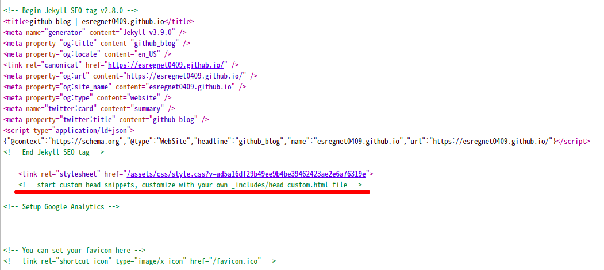

GitHub 블로그에 구글 애드센스 스크립트 삽입하는 방법 및 삽입 위치
===
   

무료 웹서버로 활용할 수 있는 GitHub Pages에 블로그를 개설했다면 각종 검색엔진에 사이트를 등록하여 검색으로 인한 유입량을 늘려야 하겠지요. 
더불어, 구글 애드센스를 연동하면 소소하지만 수익을 얻을 수도 있습니다. 
티스토리와 같은 블로그는 직접 스킨을 편집할 수 있는 기능이 있지만, 
GitHub Pages는 막상 어디에 구글 애드센스 스크립트를 삽입해야 하는지 다소 막연할 수 있습니다. 
저도 처음에는 구글 애드센스의 스크립트를 GitHub 블로그의 어디에 삽입해야 하는지 몰라서 다소 난감했습니다. 
결론부터 말씀드리자면, 사용하는 스킨에 따라서 구글 애드센스의 스크립트를 삽입하는 위치가 다를 수 있습니다.   
   
   
GitHub 블로그의 Head Script 위치 확인하는 방법
---
   

GitHub Pages를 처음 개설하면 READMD.md 파일밖에 존재하지 않기 때문에 도대체 어디를 편집해야 하는지 난감할 수 있습니다. 
이 때는 GitHub Pages의 메인 페이지에서 html 소스 보기를 하면 헤더 스크립트 파일을 어디에 작성해야 하는지에 대해서 알 수 있습니다.   
   

   

HTML 소스보기를 확인해보면 위의 빨간줄로 강조한 부분에 주석으로 커스터마이징 할 수 있는 파일 경로가 표기되어 있습니다.   
   

저는 "jekyll-theme-slate" 테마를 사용하고 있고, 저의 경우는 <code>\_includes/head-custom.html </code> 파일을 생성하면 커스터마이징이 가능합니다. 
이 경로는 스킨에 따라서 다를 수 있기 때문에 반드시 위의 방법(페이지 소스 보기)으로 확인하시기 바랍니다. 
저는 이렇게 확인하지 않고 다른 스킨을 사용하는 블로거의 경로를 따라했다가 시간과 노력을 제법 낭비했습니다. 
부디 제가 공유하는 내용을 꼼꼼히 읽어보시고 시간과 노력을 낭비하시는 일이 없으시길 바랍니다.   
   
   
GitHub Head Script 편집 방법
---
   

위의 방법으로 head snippets 경로를 확인했지만, 실제로 해당 경로에 파일은 존재하지 않습니다. 
<code>head-customer.html</code>라는 파일이 존재하지 않을 뿐더러, 
심지어는 <code>\_include</code> 라는 디렉토리도 존재하지 않습니다. 
   

뭔가 당황스럽지만 실망하기에는 아직 이릅니다. 
해당 파일이 존재하지 않으면 그냥 기존 헤더가 달리게 되고, 
해당 파일이 존재하면 그 내용이 추가로 포함되도록 되어 있습니다. 
해당 경로에다가 html 파일을 생성해주면 됩니다.   
   

<pre><code>

</code></pre>
   

<code>\_include/head-customer.html</code> 파일을 위와 같이 편집한 이후에 "페이지 소스보기"를 다시 수행했더니 위의 스크립트가 홈페이지에 제대로 삽입된 것을 확인할 수 있었습니다. 
그 이후에 구글 애드센스에서도 위의 스크립트가 정상적으로 인식이 되는 것을 확인할 수 있었습니다.   
   
   
결론
---
   

GitHub 블로그에서 구글 애드센스 스크립트 삽입하는 위치를 확인하기 위해서는 루트 페이지의 "페이지 소스 보기"를 수행하면 됩니다. 
이 위치는 사용하는 스킨에 따라서 다를 수 있습니다. 
해당 경로에 파일이 없을 경우 당황하지 마시고 해당 파일을 생성하시면 되겠습니다.   

이것으로 GitHub 페이지에 구글 애드센스 스크립트를 삽입하는 방법에 대한 글을 모두 마칩니다. 유용한 정보였기를 바랍니다. 

[✔️  무료 도메인 네임 및 무료 웹서버 추천 (GitHub 블로그 개설 방법 및 장점)](001_advantage_of_github_blog.html '본 페이지에서는 무료 웹서버로 활용할 수 있는 GitHub 블로그(GitHub Pages)에 대해서 ')
---

본 페이지에서는 무료 웹서버로 활용할 수 있는 GitHub 블로그(GitHub Pages)에 대해서 소개하고자 합니다.

[✔️  GitHub Pages에서 구글 서치 콘솔 등록 방법 아주 쉽다 (사이트 소유권 확인 방법)](002_google_search_console_apply.html 'GitHub 블로그에 구글 서치 콘솔을 등록하는 방법에 ')
---

GitHub 블로그에 구글 서치 콘솔을 등록하는 방법에 대해서 설명합니다.

[✔️  GitHub 블로그를 네이버 서치 어드바이저에 등록 방법 (네이버 웹마스터 도구에 사이트 추가 방법) ](003_naver_search_advisor.html '네이버 서치 어드바이저에 GitHub 블로그 등록 방법에 ')
---

네이버 서치 어드바이저에 GitHub 블로그 등록 방법에 대해서 설명합니다.

[✔️  GitHub Pages를 다음 검색 엔진에 등록 신청하는 방법](005_add_to_daum_search_engine.html '다음 검색 엔진에 GitHub Pages를 등록 신청하는 ')
---

다음 검색 엔진에 GitHub Pages를 등록 신청하는 방법을 설명합니다.

[✔️  GitHub Pages에서 php 문법을 사용 가능할까?](006.html 'GitHub Pages에서 php 문법 사용 가능 여부에 대')
---

GitHub Pages에서 php 문법 사용 가능 여부에 대해서 설명합니다. 

[✔️  GitHub Pages 사이트맵을 자동으로 생성해주는 bash 스크립트](007.html '사이트맵을 자동으로 생성하는 bash 스크립트 ')
---

사이트맵을 자동으로 생성하는 bash 스크립트 예제를 제공합니다.

[✔️  GitHub Pages 운영시의 꿀팁들](008.html 'GitHub Pages를 운영하면서 체득한 유용한 ')
---

GitHub Pages를 운영하면서 체득한 유용한 팁들을 제공합니다.

[✔️  SEO를 위해 GitHub Pages 의 md 파일에 헤더를 입력하는 방법](009.html 'GitHub Pages의 markdown 파일의 헤더에 title, description을 지정하는 방법에 ')
---

GitHub Pages의 markdown 파일의 헤더에 title, description을 지정하는 방법에 대해서 설명합니다.

[✔️  'GitHub Pages 빌드 에러 \"Error: No uploaded artifact was found! Please check if there are any errors at build step.\"'](010-github-no-uploaded-artifact-was-found.html ''GitHub Pages에서 빌드 에러가 발생시에 조치하는 방법에 대')
---

'GitHub Pages에서 빌드 에러가 발생시에 조치하는 방법에 대해서 설명합니다.'

[✔️  '\"mapping values are not allwed in this context at line 2 column 33\" 해결 방법'](011-github-mapping-values-are-not-allowed-in-this-context.html ''GitHub Pages의 md 파일 상단에 YAML 형식의 헤더를 추가했을 때 발생하는 \"mapping values are not allwed in this context at line 2 column 33\"에러를 조치하는 방법에 ')
---

'GitHub Pages의 md 파일 상단에 YAML 형식의 헤더를 추가했을 때 발생하는 \"mapping values are not allwed in this context at line 2 column 33\"에러를 조치하는 방법에 대해서 설명한다.'

[✔️  GitHub Pages에서 css 파일 위치](012-github-pages-css-file-path.html 'GitHub Pages에서 css를 변경하고자 할 때 편집해야하는 css 파일 위치에 ')
---

GitHub Pages에서 css를 변경하고자 할 때 편집해야하는 css 파일 위치에 대해서 설명합니다.

[✔️  GitHub Pages deploy 시에 400 에러나 502 에러가 발생할 경우 조치 방법](013-github-pages-deploy-error-400-502.html 'GitHub Pages로 새로운 변경점을 반영하려고 할 때 400 에러나 502 에러가 발생할 경우 조')
---

GitHub Pages로 새로운 변경점을 반영하려고 할 때 400 에러나 502 에러가 발생할 경우 조치하는 방법입니다.

[✔️  구글 애드센스 ads.txt 문제 해결 방법](014-google-adsense-ads-txt-warning.html '구글 애드센스에서 ads.txt 파일에 문제가 있')
---

구글 애드센스에서 ads.txt 파일에 문제가 있을 경우 조치 방법

[✔️  GitHub Pages](index.html '무료로 사용할 수 있는 정적 웹서버인 GitHub Pages 개설 ')
---

무료로 사용할 수 있는 정적 웹서버인 GitHub Pages 개설 및 운영 방법 설명

[✏️ ](https://www.github.com/boyinblue/boyinblue.github.io/edit/main/002_github_blog/004_google_adsense_github_pages.md '수정하기')

