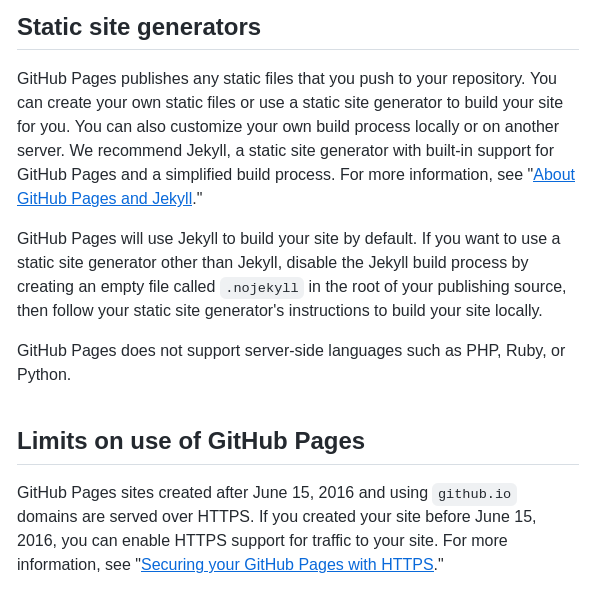

GitHub Pages에서 php 문법을 사용 가능할까?
===
   

최근에 GitHub Pages를 접하면서 깜짝 깜짝 놀라고 있습니다. 
기존의 네이버 블로그와 티스토리 블로그와 같은 정형화된 블로그들의 한계를 맞보고, 
새로운 웹서비스를 찾아보다가 GitHub Pages가 눈에 들어왔습니다. 
   

Markdown 문법을 통해서 손쉽고도 시원시원하게 글을 작성할 수 있는데다가, 
하루에 발행할 수 있는 글의 개수에 제한이 없다는건 엄청난 메리트입니다. 
또한 구글 애드센스를 달 수 있기 때문에 수익형 블로그를 꿈꾸는 저에게 딱 맞는 웹서비스임에 틀림없다고 판단했습니다.   

   
기존 블로그 서비스들은 robots.txt, RSS, 사이트 맵 등을 전혀 신경 쓸 필요가 없었습니다. 
반면, GitHub Pages의 경우는 직접 robots.txt, sitemap.xml 파일 등을 생성해줘야 하기 때문에 이 부분이 다소 불편한 점이 있는 것 같습니다.   


robots.txt 파일의 경우는 없어도 무방하고, 수동으로 작성해줘도 됩니다. 
반면, 사이트 맵의 경우 하위 페이지가 생성될 때마다 갱신해줘야하므로 동적으로 자동 생성하지 않으면 여간 불편하게 아닐 수 없습니다.   


sitemap.xml 파일을 동적으로 생성할 수 있는 방법들은 여러가지가 있습니다. xml 문법을 이용해도 되고, php, java, bash 등 자동으로 생성할 수 있는 방법들은 무궁무진합니다.   


그리하여 GitHub Pages에서 php 문법을 사용 가능한지에 대해서 궁금증이 발동하기 시작했습니다. 과면 GitHub Pages에서 php 문법을 지원할까요?   

   
GitHub Pages에서 php 문법이 동작하는지 확인해보자!
---

   
자, 그럼 지금부터 GitHub Pages에 php 문법이 동작하는지 확인해보겠습니다. 
https://boyinblue.github.io의 root 디렉토리에 test.php 파일을 생성해서 <code>< phpinfo()? ?></code>를 입력합니다.   

   
만약 GitHub Pages에서 php를 지원한다면 https//boyinblue.github.io/test/test.php 경로로 접속했을 때 <code>phpinfo()?</code> 구문이 정상적으로 동작할 것입니다.   

   
```php
<?
  phpinfo();
?>
```

   
위와 같이 작성을 완료하고 https://boyinblue.github.io/test/test.php 경로로 접속을 시도하면 그냥 test.php 파일이 다운로드됩니다. 
아쉽게도, GitHub Pages는 PHP 문법을 지원하지 않는 것을 알 수 있습니다.   

   
GitHub Pages Article 확인
---

   
실제로 php가 동작하지 않는 것을 확인했지만, 실제로 [GitHub Pages Article](https://docs.github.com/en/pages/getting-started-with-github-pages/about-github-pages "GitHub Pages Article") 을 살펴보겠습니다.
   



   
위의 이미지는 GitHub Pages 문서에 명시된 부분을 캡쳐한 내용입니다. 
"GitHub Pages does not support server-side languages such as PHP, Ruby, or Python." 라는 문구가 보입니다. GitHub Pages는 PHP, Ruby, Python과 같은 서버에서 동작하는 언어들을 지원하지 않는다는 내용입니다.   

   
PHP 대신 Jekyll 사용을 추천
---

   
아쉽게도 GitHub Pages에서 PHP와 같은 dynamic pages를 지원하지는 않지만 
Jekyll을 통해서 정적 페이지를 생성하는 것을 지원을 하는 것을 알 수 있습니다. 
실제로 GitHub Pages는 기본적으로 Jekyll을 제공하고 있습니다. 
이 때문에 우리가 GitPages의 최상위 경로에 어떤 디자인을 정의하지 않더라도 
어느정도 페이지의 디자인이 볼만하다는 장점이 있습니다.   

   
Jekyll을 사용하고 싶지 않다면?
---

   
만약 Jekyll을 사용하고 싶지 않다면 취상위 디렉토리에 .nojekyll 이라는 빈 파일을 생성하면 됩니다.   

   
결론
---

   
GitHub Pages에서 PHP와 같이 Server-side에서 동작하는 동적 페이지를 구현할 수는 없습니다. 대신 Jekyll을 이용해서 정적 페이지는 얼마든지 생성할 수 있습니다. 만약, Jekyll을 사용하고 싶지 않으면 최상위 디렉토리에 .nojekyll 이라는 빈 파일을 생성하면 되겠습니다.   


이상입니다.   


[✔️  무료 도메인 네임 및 무료 웹서버 추천 (GitHub 블로그 개설 방법 및 장점)](001_advantage_of_github_blog.html '본 페이지에서는 무료 웹서버로 활용할 수 있는 GitHub 블로그(GitHub Pages)에 대해서 ')
---


본 페이지에서는 무료 웹서버로 활용할 수 있는 GitHub 블로그(GitHub Pages)에 대해서 소개하고자 합니다.


[✔️  GitHub Pages에서 구글 서치 콘솔 등록 방법 아주 쉽다 (사이트 소유권 확인 방법)](002_google_search_console_apply.html 'GitHub 블로그에 구글 서치 콘솔을 등록하는 방법에 ')
---


GitHub 블로그에 구글 서치 콘솔을 등록하는 방법에 대해서 설명합니다.


[✔️  GitHub 블로그를 네이버 서치 어드바이저에 등록 방법 (네이버 웹마스터 도구에 사이트 추가 방법) ](003_naver_search_advisor.html '네이버 서치 어드바이저에 GitHub 블로그 등록 방법에 ')
---


네이버 서치 어드바이저에 GitHub 블로그 등록 방법에 대해서 설명합니다.


[✔️  GitHub 블로그에 구글 애드센스 스크립트 삽입하는 방법 및 삽입 위치](004_google_adsense_github_pages.html 'GitHub Pages에 구글 애드센스 스크립트를 삽입하는 ')
---


GitHub Pages에 구글 애드센스 스크립트를 삽입하는 위치를 설명합니다.


[✔️  GitHub Pages를 다음 검색 엔진에 등록 신청하는 방법](005_add_to_daum_search_engine.html '다음 검색 엔진에 GitHub Pages를 등록 신청하는 ')
---


다음 검색 엔진에 GitHub Pages를 등록 신청하는 방법을 설명합니다.


[✔️  GitHub Pages 사이트맵을 자동으로 생성해주는 bash 스크립트](007.html '사이트맵을 자동으로 생성하는 bash 스크립트 ')
---


사이트맵을 자동으로 생성하는 bash 스크립트 예제를 제공합니다.


[✔️  GitHub Pages 운영시의 꿀팁들](008.html 'GitHub Pages를 운영하면서 체득한 유용한 ')
---


GitHub Pages를 운영하면서 체득한 유용한 팁들을 제공합니다.


[✔️  SEO를 위해 GitHub Pages 의 md 파일에 헤더를 입력하는 방법](009.html 'GitHub Pages의 markdown 파일의 헤더에 title, description을 지정하는 방법에 ')
---


GitHub Pages의 markdown 파일의 헤더에 title, description을 지정하는 방법에 대해서 설명합니다.


[✔️  'GitHub Pages 빌드 에러 \"Error: No uploaded artifact was found! Please check if there are any errors at build step.\"'](010-github-no-uploaded-artifact-was-found.html ''GitHub Pages에서 빌드 에러가 발생시에 조치하는 방법에 대')
---


'GitHub Pages에서 빌드 에러가 발생시에 조치하는 방법에 대해서 설명합니다.'


[✔️  '\"mapping values are not allwed in this context at line 2 column 33\" 해결 방법'](011-github-mapping-values-are-not-allowed-in-this-context.html ''GitHub Pages의 md 파일 상단에 YAML 형식의 헤더를 추가했을 때 발생하는 \"mapping values are not allwed in this context at line 2 column 33\"에러를 조치하는 방법에 ')
---


'GitHub Pages의 md 파일 상단에 YAML 형식의 헤더를 추가했을 때 발생하는 \"mapping values are not allwed in this context at line 2 column 33\"에러를 조치하는 방법에 대해서 설명한다.'


[✔️  GitHub Pages에서 css 파일 위치](012-github-pages-css-file-path.html 'GitHub Pages에서 css를 변경하고자 할 때 편집해야하는 css 파일 위치에 ')
---


GitHub Pages에서 css를 변경하고자 할 때 편집해야하는 css 파일 위치에 대해서 설명합니다.


[✔️  GitHub Pages deploy 시에 400 에러나 502 에러가 발생할 경우 조치 방법](013-github-pages-deploy-error-400-502.html 'GitHub Pages로 새로운 변경점을 반영하려고 할 때 400 에러나 502 에러가 발생할 경우 조')
---


GitHub Pages로 새로운 변경점을 반영하려고 할 때 400 에러나 502 에러가 발생할 경우 조치하는 방법입니다.


[✔️  구글 애드센스 ads.txt 문제 해결 방법](014-google-adsense-ads-txt-warning.html '구글 애드센스에서 ads.txt 파일에 문제가 있')
---


구글 애드센스에서 ads.txt 파일에 문제가 있을 경우 조치 방법


[✔️  GitHub Pages](index.html '무료로 사용할 수 있는 정적 웹서버인 GitHub Pages 개설 ')
---


무료로 사용할 수 있는 정적 웹서버인 GitHub Pages 개설 및 운영 방법 설명
