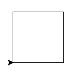
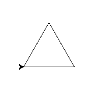
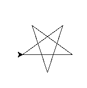
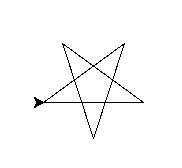
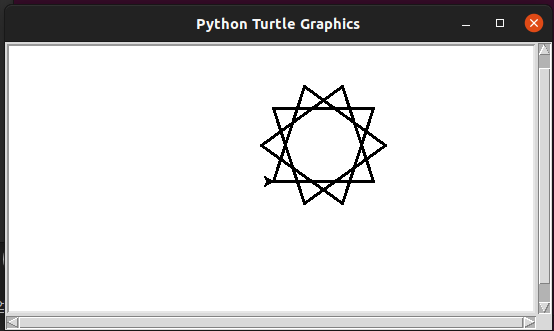
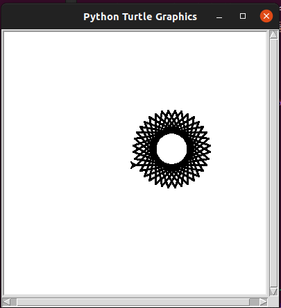
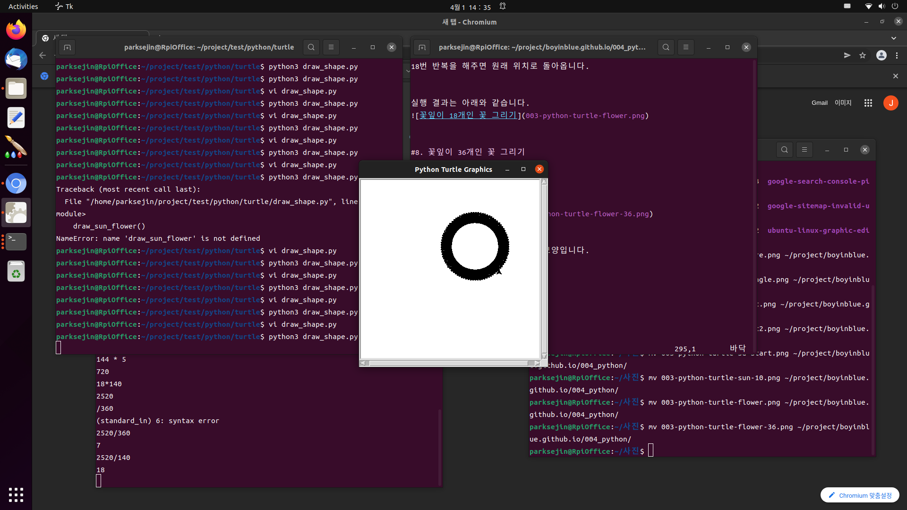
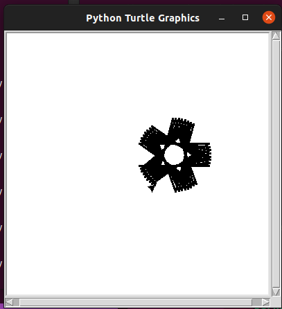

파이썬 터틀 그래픽 재미있는 모양 예제
===


저희 첫째 아들과 파이썬 터틀그래픽으로 재미있는 모양들을 그려보면서 
즐거운 시간을 보냈습니다. 


터틀 그래픽을 통해서 간단한 그리기 예제들을 제공합니다. 


### 본 페이지에서 다루는 터틀 그래픽 메쏘드


|메쏘드|동작|
|--|--|
|forward()|선분을 그립니다.|
|left()|왼쪽으로 회전합니다.|
|right()|오른쪽으로 회전합니다.|
|speed()|그리기 속도를 조정합니다.|
|width()|펜의 두께를 조정합니다.|
|setup()|그리기 화면의 크기를 조정합니다.|


가장 기본적인 동작부터 시작해서 
하나씩 메쏘드를 추가하면서 설명드리겠습니다. 


#1. 사각형 그리기
---


가장 먼저 사각형 그리기 예제부터 나갑니다. 


```python
import turtle

for i in range(0,4):
  turtle.forward(100)
  turtle.left(90)
```


### 수행결과





위의 스크립트를 간략하게 설명하자면 <code>for</code> 구문을 통해서 
선분 긋기와 방향 전환을 4번 연속 수행하는 스크립트입니다. 


<code>import turtle</code> 구문은 터틀 그래픽을 사용할 수 있게 해줍니다. 


<code>for i in range(0,4)</code> 구문을 통해서 4번을 반복합니다. 


<code>turtle.forward(100)</code> 구문은 길이 100 픽셀의 선분을 긋습니다. 


<code>turtle.left(90)</code> 구문은 왼쪽으로 90도만큼 회전을 합니다. 


종합해보면 아래와 같은 동작으로 사각형을 만들어 냅니다. 
1. 오른쪽으로 100만큼 선분을 긋고 왼쪽으로 90도 회전합니다.
2. 위쪽으로 100만큼 선분을 긋고 왼쪽으로 90도 회전합니다. 
3. 왼쪽으로 100만큼 선분을 긋고 왼쪽으로 90도 회전합니다. 
4. 아래쪽으로 100만큼 선분을 긋고 왼쪽으로 90도 회전합니다. 


#2. 삼각형 그리기
---


스크립트를 살짝만 수정하면 이번에는 삼각형을 그릴 수 있습니다. 


```python
import turtle
import time

for i in range(0,3):
  turtle.forward(100)
  turtle.left(120)

time.sleep(3)
```


위의 같이 회전하는 각도를 90도에서 120도로 늘려주면 
정삼각형을 그릴 수 있습니다. 


### 수행 결과는 아래와 같습니다. 





모양을 사각형에서 삼각형으로 바꾸는 것 외에도 
스크립트를 조금 더 수정하였습니다. 
눈치채셨나요? 


그리기가 끝나자마자 창이 닫히기 때문에 다 그려진 이후에 
약 3초동안의 딜레이를 추가하였습니다. 


```python
import time

time.sleep(3)
```


지연 시간을 주기 위해서는 우선 <code>import time</code> 모듈을 추가해야 합니다. 


실제로 지연시간을 주는 함수는 <code>time.sleep(3)</code> 구문입니다. 


위의 구문으로 3초 동안의 지연 시간을 줄 수 있습니다. 


인자로 실수를 입력하면 1초 이내의 시간동안 지연시키는 것도 가능합니다. 


<code>time.sleep(0.1)</code> 구문은 0.1초 동안의 딜레이를 제공합니다. 


#3. 별 그리기
---


다음으로 별을 그리는 방법입니다. 


```python
import turtle
import time

def draw_star():
  for i in range(0,5):
    turtle.forward(100)
    turtle.left(144)

  time.sleep(5)

if __name__ == '__main__':
  draw_star()
```


### 수행 결과는 아래와 같습니다. 





144도씩 총 5번을 회전해서 별이 완성되었습니다. 
총 720도를 회전해서 시작 위치로 돌아왔습니다. 


참고로 시작 위치로 돌아오게 하기 위해서는 
최소 공배수를 360도의 배수로 맞추면 됩니다. 


이번에도 기존에 없는 구문을 조금 더 추가하였습니다. 


<code>def draw_star():</code> 구문을 통해서 별을 그리는 구문을 
함수로 작성하였습니다. 


또한 <code>if __name__ == '__main__':</code> 구문을 통해서 
main으로 실행될 때만 별 모양이 그려지도록 했습니다. 
따라서 다른 파이선 스크립트에서 모듈로 import 되었을 때에는 
<code>draw_start()</code> 함수를 호출해야만 실행되도록 하였습니다. 


지금부터 설명드리는 모양 예제들을 함수 형태로만 제공하겠습니다. 


#4. 오른쪽으로 회전하면서 별 그리기
---


이번에는 반대 방향으로 별을 그려보겠습니다. 


```python
def draw_star_reverse():
  for i in range(0,5):
    turtle.forward(100)
    turtle.right(144)
```


### 실행 결과는 아래와 같습니다. 





<code>turtle.left(144)</code> 구문 대신에 
<code>turtle.right(144)</code> 구문을 사용해서 
왼쪽이 아닌 오른쪽으로 회전하면서 별을 그리도록 했습니다. 


저희 아들이 이건 별이 아니라 여우같다고 하네요.


#5. 입체 모양의 별 그리기
---


이번에는 각도를 살짝 어긋나게해서 살짝 입체적인 느낌이 들도록 
별을 좀 더 예쁘게 그려보겠습니다. 


```python
def draw_3d_star():
  for i in range(0,10):
    turtle.forward(100)
    turtle.left(145)
```


### 수행 결과


위와 같이 1도씩 틀어지게하고, 선분 개수를 2배로 늘이면 됩니다. 


#6. 태양 그리기
---


이번에는 팬 크기를 좀 더 키워서 
왕관 모양이 10개짜리 태양을 그려보겠습니다. 


```python
def draw_sun():

  turtle.width(3)

  for i in range(0,10):
    turtle.forward(100)
    turtle.left(108)
```


### 실행 결과





<code>turtle.width(3)</code> 구문을 통해서 좀 더 두꺼운 펜으로 
그림을 그릴 수 있게 되었습니다. 


108도와 360도의 최소 공배수는 1080이므로 
<code>for</code> 구문으로 10번만 반복하면 됩니다. 
또한 태양의 왕관 모양의 개수는 총 10개가 됩니다. 


#7. 꽃잎 모양 그리기 (꽃잎 18개)
---


이번에는 각도를 살짝 조정해서 꽃을 그려보겠습니다. 


```python
def draw_sun2():
  turtle.width(3)
  for i in range(0,18):
    turtle.forward(100)
    turtle.left(140)
```


기존의 태양이 108도만큼 회전을 했다면 
이번에는 140도 만큼 회전을 하도록 변경하였습니다. 


140도와 360도 배수와의 최소 공배수는 2520도 이므로 
18번 반복을 해주면 원래 위치로 돌아옵니다. 


### 실행 결과는 아래와 같습니다.


 

#8. 꽃잎이 36개인 꽃 그리기
---


### 실행 결과





실행 결과를 보면 국화랑 비슷한 모양입니다. 


#9. 자동차 바퀴 그리기
---


이번에는 자동차 바퀴를 그려보겠습니다. 


```python
def draw_tier():
  turtle.speed(0)
  for i in range(0,90):
    turtle.forward(100)
    turtle.left(89)
```


89도씩 90번을 회전하면 선분으로 타이어를 그릴 수 있습니다. 





이번에는 <code>turtle.speed()</code> 메쏘드를 살짝 끼워 넣었습니다. 


그 이유는 선분을 무려 90개나 그리기 때문에 
<code>Normal Speed</code>로 그리면 너무 오래 걸리기 때문입니다. 


<code>turtle.speed()</code> 메소드는 그리기 속도를 변경하는 함수입니다. 


넣어주는 인자에 따라서 다른 속도로 그릴 수 있습니다. 


### turtle.speed() 함수의 매개변수

|인자|의미|
|--|--|
|0|최고 속도|
|1|속도가 느림|
|...|값이 커질수록 점점 빨라짐|
|10|속도가 빠름|

인자를 넣을때 주의할 점입니다.
- 1에서부터 10까지 갈수록 점점 빨라짐.
- 0은 최고 속도라는 것에 주의
- 실수는 입력이 안됨. (ex : 0.5를 입력하면 0이 됨)
- 10 이상의 값을 입력해도 10이상 빨라지지 않음


#10. 자동차 휠 그리기
---


이번에는 입체적인 별모양 그리기를 살짝 응용해서 
자동차 휠을 그리는 예제를 제공합니다. 


```python
def draw_wheel():
  turtle.setup(width=400, height=400)
  for i in range(0,40):
    turtle.forward(100)
    turtle.left(145)
```


### 수행 결과





결과를 보면, 5각형 모양의 별이 그려지는듯 하더니, 
별 모양에서 1도씩 틀어지는 궤적이 남게 됩니다. 


이 궤적이 어느정도 중첩되면 결국 휠 모양이 되게 됩니다. 


이번 예제에서는 <code>turtle.setup()</code>이라는 새로운 메소드가 등장합니다. 


<code>turtle.setup(width=400, height=400)</code> 구문은 
터틀 그래픽이 그려질 윈도우의 크기를 변경하는 메소드입니다. 


가로 400 픽셀, 세로 400 픽셀 크기로 윈도우 크기가 변경이 됩니다. 


결론
---


이것으로 파이썬 터틀 그래픽을 이용해서 여러가지 모양들을 생성하는 
파이썬 스크립트 예제를 살펴보았습니다. 


다음 페이지에서는 <code>circle()</code> 메쏘드를 이용해서 
좀 더 다양한 모양의 예제들을 제공합니다. 


<!--001.html-->
[✔️  OpenCV를 이용하여 이미지를 출력하는 방법과 캠을 동작시키는 방법](001.html)
---


OpenCV를 이용해서 이미지를 출력하는 방법과 실시간으로 캠 영상을 표시하는 방법에 대해서 설명합니다.  


<!--002.html-->
[✔️  파이선 터틀 그래픽을 이용해서 간단한 랜덤 문자 출력 방법](002.html)
---


파이선 터틀 그래픽을 이용하여 간단한 랜덤 문자를 출력하는 방법에 대해서 설명합니다.


<!--003-python-명령행인자.html-->
[✔️  파이썬 명령행 인자 사용 방법](003-python-명령행인자.html)
---


파이썬 스크립트 실행시에 명령행 인자를 추가하는 방법


<!--004-python-vim-setting.html-->
[✔️  파이썬 vim 띄워쓰기 설정 방법](004-python-vim-setting.html)
---


vim을 이용하여 파이썬 스크립트 편집시에 띄워쓰기 설정 방법


<!--005-python-cannot-read-home-directory.html-->
[✔️  파이썬 홈디렉토리 파일 오픈 방법](005-python-cannot-read-home-directory.html)
---


파이썬에서 홈 디렉토리의 파일을 오픈하는 방법에 대해서 설명합니다.


<!--006-python-no-module-speech-recognition.html-->
[✔️  파이썬 스크립트 실행시 No module named speech_recognition 에러가 발생했을 때 조치 방법](006-python-no-module-speech-recognition.html)
---


파이썬 스크립트 실행시 No module named speech_recognition 이라는 에러가 발생했을 때 설치해야 하는 패키지명에 대해서 설명합니다. 


<!--007-python-playsound.html-->
[✔️  파이썬에서 MP3 파일 비동기 재생 방법 (playsound async)](007-python-playsound.html)
---


파이썬에서 MP3 파일 재생 방법과 playsound를 통해 비동기 재생 방식에 대해서 설명합니다.


<!--008-python-wordpress-update.html-->
[✔️  파이썬으로 워드프레스 글 자동 발행하기](008-python-wordpress-update.html)
---


파이썬으로 워드프레스 글을 자동 발행하는 방법에 대해서 설명합니다.


<!--_README.html-->
[✔️  Python](_README.html)
---


Python 언어에 대한 내용을 기록하는 페이지입니다.


<!--index.html-->
[✔️  Python](index.html)
---


Python 언어에 대한 내용을 기록하는 페이지입니다.


<!--001.html-->
[✔️  OpenCV를 이용하여 이미지를 출력하는 방법과 캠을 동작시키는 방법](001.html)
---


OpenCV를 이용해서 이미지를 출력하는 방법과 실시간으로 캠 영상을 표시하는 방법에 대해서 설명합니다.  


<!--002.html-->
[✔️  파이선 터틀 그래픽을 이용해서 간단한 랜덤 문자 출력 방법](002.html)
---


파이선 터틀 그래픽을 이용하여 간단한 랜덤 문자를 출력하는 방법에 대해서 설명합니다.


<!--003-python-명령행인자.html-->
[✔️  파이썬 명령행 인자 사용 방법](003-python-명령행인자.html)
---


파이썬 스크립트 실행시에 명령행 인자를 추가하는 방법


<!--004-python-vim-setting.html-->
[✔️  파이썬 vim 띄워쓰기 설정 방법](004-python-vim-setting.html)
---


vim을 이용하여 파이썬 스크립트 편집시에 띄워쓰기 설정 방법


<!--005-python-cannot-read-home-directory.html-->
[✔️  파이썬 홈디렉토리 파일 오픈 방법](005-python-cannot-read-home-directory.html)
---


파이썬에서 홈 디렉토리의 파일을 오픈하는 방법에 대해서 설명합니다.


<!--006-python-no-module-speech-recognition.html-->
[✔️  파이썬 스크립트 실행시 No module named speech_recognition 에러가 발생했을 때 조치 방법](006-python-no-module-speech-recognition.html)
---


파이썬 스크립트 실행시 No module named speech_recognition 이라는 에러가 발생했을 때 설치해야 하는 패키지명에 대해서 설명합니다. 


<!--007-python-playsound.html-->
[✔️  파이썬에서 MP3 파일 비동기 재생 방법 (playsound async)](007-python-playsound.html)
---


파이썬에서 MP3 파일 재생 방법과 playsound를 통해 비동기 재생 방식에 대해서 설명합니다.


<!--008-python-wordpress-update.html-->
[✔️  파이썬으로 워드프레스 글 자동 발행하기](008-python-wordpress-update.html)
---


파이썬으로 워드프레스 글을 자동 발행하는 방법에 대해서 설명합니다.


<!--_README.html-->
[✔️  Python](_README.html)
---


Python 언어에 대한 내용을 기록하는 페이지입니다.


<!--index.html-->
[✔️  Python](index.html)
---


Python 언어에 대한 내용을 기록하는 페이지입니다.


<!--001.html-->
[✔️  OpenCV를 이용하여 이미지를 출력하는 방법과 캠을 동작시키는 방법](001.html)
---


OpenCV를 이용해서 이미지를 출력하는 방법과 실시간으로 캠 영상을 표시하는 방법에 대해서 설명합니다.  


<!--002.html-->
[✔️  파이선 터틀 그래픽을 이용해서 간단한 랜덤 문자 출력 방법](002.html)
---


파이선 터틀 그래픽을 이용하여 간단한 랜덤 문자를 출력하는 방법에 대해서 설명합니다.


<!--003-python-명령행인자.html-->
[✔️  파이썬 명령행 인자 사용 방법](003-python-명령행인자.html)
---


파이썬 스크립트 실행시에 명령행 인자를 추가하는 방법


<!--004-python-vim-setting.html-->
[✔️  파이썬 vim 띄워쓰기 설정 방법](004-python-vim-setting.html)
---


vim을 이용하여 파이썬 스크립트 편집시에 띄워쓰기 설정 방법


<!--005-python-cannot-read-home-directory.html-->
[✔️  파이썬 홈디렉토리 파일 오픈 방법](005-python-cannot-read-home-directory.html)
---


파이썬에서 홈 디렉토리의 파일을 오픈하는 방법에 대해서 설명합니다.


<!--006-python-no-module-speech-recognition.html-->
[✔️  파이썬 스크립트 실행시 No module named speech_recognition 에러가 발생했을 때 조치 방법](006-python-no-module-speech-recognition.html)
---


파이썬 스크립트 실행시 No module named speech_recognition 이라는 에러가 발생했을 때 설치해야 하는 패키지명에 대해서 설명합니다. 


<!--007-python-playsound.html-->
[✔️  파이썬에서 MP3 파일 비동기 재생 방법 (playsound async)](007-python-playsound.html)
---


파이썬에서 MP3 파일 재생 방법과 playsound를 통해 비동기 재생 방식에 대해서 설명합니다.


<!--008-python-wordpress-update.html-->
[✔️  파이썬으로 워드프레스 글 자동 발행하기](008-python-wordpress-update.html)
---


파이썬으로 워드프레스 글을 자동 발행하는 방법에 대해서 설명합니다.


<!--_README.html-->
[✔️  Python](_README.html)
---


Python 언어에 대한 내용을 기록하는 페이지입니다.


<!--index.html-->
[✔️  Python](index.html)
---


Python 언어에 대한 내용을 기록하는 페이지입니다.
