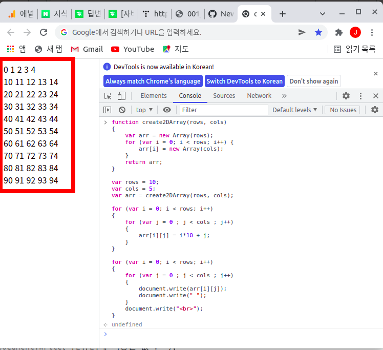

자바스크립트에서 2차원 배열 선언 및 사용 방법
===

   
본 페이지에서는 자바스크립트에서 2차원 배열을 선언하고 사용하는 방법에 대해서 다루고자 합니다. 

   
2차원 배열의 선언
---

   
자바스크립트에서 2차원 배열의 선언은 다른 언어들과는 조금 다릅니다. 
자바스크립트는 2차원 배열은 1차원 배열을 생성한 이후에 그 안에 다시 1차원 배열을 동적으로 할당하는 방식으로 생성할 수 있습니다. 
다소 번거롭다고 생각될 수 있겠습니다 단점이 될 수도 있고, 장점이 될 수도 있습니다.   

   
### C에서의 2차원 배열 선언 및 사용 예시

   
우선 C언어에서의 2차원 배열 선언 및 사용에 대해서 잠깐 살펴볼께요. 
C언어를 예시로 제시한 이유는 C언어에서의 2차원 배열 및 그 이상의 다차원 배열의 선언 및 사용이 아주 간단하면서도 직관적이기 때문입니다.   

   
```c
int arr[10][5];

arr[0][0] = 10;

printf("%d", arr[0][0]);
```

   
C언어에서는 위와 같이 손쉽게 2차원 배열을 선언하고, 값을 할당하고, 저장된 값을 읽어올 수 있습니다. 
하지만 배열의 크기를 미리 선언해야하기 때문에 프로그램이 동작 중에 배열의 크기를 늘이거나 줄이기는 어렵습니다. 
또한 행별로 다른 컬럼 수를 가지도록 하는 것도 불가능한 단점이 있습니다.   


### 자바스크립트에서 2차원 배열을 생성하는 가장 간단한 방법

   
그럼 이번에는 자바스크립트에서 2차원 배열 선언은 어떻게 할 수 있을까요? 
아쉽게도 자바스크립트에서는 C처럼 직관적이고 간단하게 2차원 배열을 생성할 수는 없습니다. 
그렇지만 방법이 아예 없는 것은 아닙니다. 
1차원 배열을 선언한 이후에 그 안에 다시 1차원 배열을 선언하면 됩니다.   

   
```javascript
var arr = new Array(10);
for( var i = 0 ; i < 10 ; i++ )
{
  arr[i] = new Array(5);
}
```

   
자바스크립트에서는 위와 같이 2차원 배열을 선언할 수 있고, 
C언어에서의 2차원 배열 선언보다는 조금 더 번거롭다는 것을 알 수 있습니다.   


### 자바스크립트에서 2차원 배열을 생성하는 좀 더 좋은 방법

   
위의 스크립트를 조금 수정하면 rows 변수와 cols 변수를 이용해서 생성하는 것도 가능합니다. 
거의 모든 프로그래밍 언어에서 값을 하드코딩해서 쓰는 방법은 좋은 방법이 아닙니다. 
아래와 같이 행수(rows)와 열수(cols)를 변수로 선언해서 쓰는게 좋습니다. 
왜냐하면, 이후에 행렬의 크기가 변경되었을 때 rows 값과 cols 값만 수정하면 되기 때문입니다.   

   
```javascript
var rows = 10;
var cols = 5;

var arr = new Array(rows);

for( var i = 0 ; i < rows ; rows++ )
{
  arr[i] = new Array(cols);
}
```


### 자바스크립트에서 2차원 배열을 생성하는 가장 좋은 방법

   
만약 스크립트 안에서 여러개의 2차원 배열을 생성해야 한다면, 
2차원 배열을 생성하는 부분을 함수화할 수 있습니다.   

   
```javascript
function create2DArray(rows, cols)
{
    var arr = new Array(rows);
    for (var i = 0; i < rows; i++) {
        arr[i] = new Array(cols);
    }
    return arr;
}

var arr1 = create2DArray(10, 5);
var arr2 = create2DArray(3, 7);
```

   
2차원 배열을 생성하고 싶을 때마다 저 함수를 호출하면 간단하게 생성할 수 있습니다. 

   
2차원 배열에 값을 저장하는 방법
---
   

그러면 위에서 생성한 2차원 배열에 값을 할당하는 방식은 어떻게 될까요? 
사용 방법은 다행히 C언어와 유사합니다. 
우선 값을 저장하는 방법입니다.   

   
```javascript
for (var i = 0; i < rows; i++)
{
    for (var j = 0 ; j < cols ; j++)
    {
        arr[i][j] = i*10 + j;
    }
}
```

   
위와 같은 방법으로 2차원 배열에 값을 저장할 수 있습니다.    

   
2차원 배열에 저장된 값을 사용하는 방법
---

   
저장된 값을 사용하는 방법 역시도 아주 간단합니다.   


```javascript
document.write("[2][2]에 저장된 값 : ");
document.write(arr[2][2]);
```

   
2차원 배열에 저장된 값을 덤프(dump)하는 방법
---


혹은 for 문으로 배열을 순회하면서 2차원 배열 전체의 내용을 덤프(dump)하는 방법도 있습니다.   

   
```javascript
for (var i = 0; i < rows; i++)
{
    for (var j = 0 ; j < cols ; j++)
    {
        document.write(arr[i][j]);
        document.write(" ");
    }
    document.write("\n");
}
```

   
본 페이지에서 사용한 예시 전체
---

   
본 페이지에서 사용한 예시 전체를 하나의 스크립트로 보여드리겠습니다. 

   
```javascript
function create2DArray(rows, cols)
{
    var arr = new Array(rows);
    for (var i = 0; i < rows; i++) {
        arr[i] = new Array(cols);
    }
    return arr;
}

var rows = 10;
var cols = 5;
var arr = create2DArray(rows, cols);

for (var i = 0; i < rows; i++)
{
    for (var j = 0 ; j < cols ; j++)
    {
        arr[i][j] = i*10 + j;
    }
}

for (var i = 0; i < rows; i++)
{
    for (var j = 0 ; j < cols ; j++)
    {
        document.write(arr[i][j]);
        document.write(" ");
    }
    document.write("<br>");
}
```

   
위의 스크립트를 수행하면 아래 화면과 같이 2차원 배열의 내용이 모두 출력됩니다.  

   



<!--_README.html-->
[✔️  Java Script](_README.html)
---


Java Script 언어에 대한 내용을 기록하고 설명합니다.


<!--index.html-->
[✔️  Java Script](index.html)
---


Java Script 언어에 대한 내용을 기록하고 설명합니다.


<!--_README.html-->
[✔️  Java Script](_README.html)
---


Java Script 언어에 대한 내용을 기록하고 설명합니다.


<!--index.html-->
[✔️  Java Script](index.html)
---


Java Script 언어에 대한 내용을 기록하고 설명합니다.


<!--_README.html-->
[✔️  Java Script](_README.html)
---


Java Script 언어에 대한 내용을 기록하고 설명합니다.


<!--index.html-->
[✔️  Java Script](index.html)
---


Java Script 언어에 대한 내용을 기록하고 설명합니다.
