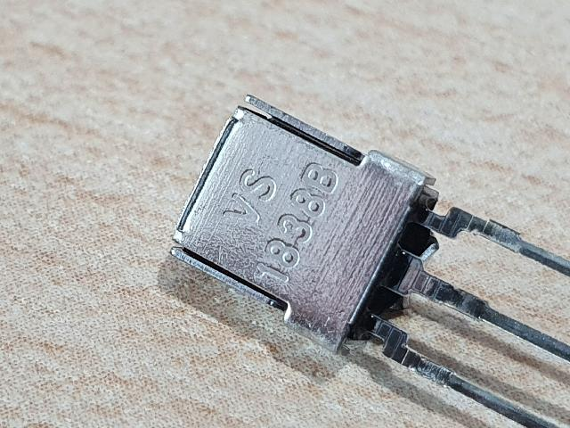
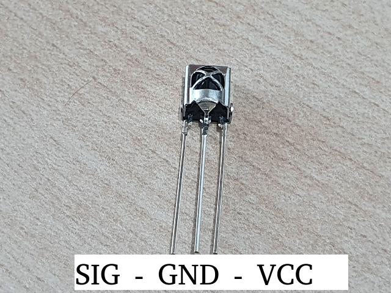

라즈베리파이4B에서 리모컨 입력 받아서 처리하는 방법
===


라즈베리파이4B에서 리모컨 입력 받아서 처리하는 방법을 설명합니다. 
사실, 라즈베리파이를 이용해서 프로젝트를 진행하거나, 
스터디를 진행함에 있어서 가장 쉽게 접근할 수 있고, 
가장 손쉽게 정보를 얻을 수 있는 방법은 라즈비안을 사용하는 것입니다. 


하지만 제게 가장 익숙한 OS인 Ubuntu Linux를 포기할 수 없어서, 
라즈베리파이4B(rpi4)에 Ubuntu Linux 21.10을 설치했습니다. 


IR 센서를 이용해서 리모컨 입력을 받아서 처리하는 작업을 진행해보았습니다. 
대부분의 자료들이 라즈비안 베이스라서 Ubuntu Linux에서는 
어떻게 설정해야 하는지에 대한 정보를 얻기가 쉽지는 않았습니다. 


본 페이지에서는 Ubuntu Linux 21.10에서 VS 1838B IR 센서를 이용해서 
리모컨 입력을 받는 방법에 대해서 설명하고자 합니다. 





부디 여러분들이 찾는 도움이 되는 자료이기를 바랍니다.  


### 환경


|구분|세부 내용|비고|
|--|--|--|
|IR 센서|VS 1838B|   |
|H/W|Rpi4|   |
|OS|Ubuntu Linux 21.10|   |


OS 버전을 확인하려면 <code>lsb_release -a</code>를 입력하시면 됩니다. 


```
$ lsb_release -a
No LSB modules are available.
Distributor ID:	Ubuntu
Description:	Ubuntu 21.10
Release:	21.10
Codename:	impish
```


제 RPi4에는 Ubuntu Linux 21.10이 설치되어 있습니다. 


### 하드웨어 연결


하드웨어 구성은 아주 간단합니다. 
<code>VS 1838B</code>라는 리모컨 수신 모듈은 
동작 전압이 3.3V이기 때문에 별도로 전압을 강하해줄 필요 없이 
라즈베리파이에 바로 연결이 가능합니다. 


VS 1838B를 정면에서 바라보았을 때, 
가장 왼쪽부터 <code>Output</code>, <code>GND</code>, <code>Vcc</code> 입니다.





|핀번호|신호|비고|
|--|--|--|
|1|Output|17번 핀에 연결|
|2|GND|   |
|3|Vcc|3.3V|


#### 회로 구성이 올바른지 확인 방법 #1


Output에 3.3V LED를 연결하면 리모컨 버튼을 눌렀을 때, 
LED가 아주 빠르게 깜빡거리는 것을 확인할 수 있습니다. 
그러면 회로 구성이 올바르게 되었다는 것을 알 수 있습니다. 


#### 회로 구성이 올바른지 확인 방법 #2


또한 회로 연결이 제대로 되었는지 확인하는 추가적인 방법은 
파이썬으로 GPIO17번 포트를 연속적으로 읽어보는 방법이 있습니다. 


이 때, 리모컨 버튼을 눌렀을 때 GPIO17번으로 읽은 입력이 변화한다면 
회로 연결이 제대로 구성되었다고 추측할 수 있겠습니다. 


### lirc 설치 및 설정


지금부터는 lirc 패키지를 설치하고, 설정 파일들을 편집해주는 작업입니다.


1. lirc 패키지 설치
2. /etc/lirc/lirc_options.conf 파일 편집
3. /boot/firmware/config.txt 파일 편집
4. ~~/etc/modules 파일 편집~~


#### lirc 패키지 설치


아래 명령으로 <code>lirc</code> 패키지를 설치합니다.


```bash
$ sudo apt-get update
$ sudo apt-get upgrade
$ sudo apt-get install lirc
```


#### /etc/lirc/lirc_options.conf 파일 편집


아래 명령으로 <code>/etc/lirc/lirc_options.conf</code> 파일을 편집해줍니다.


```bash
$ sudo vi /etc/lirc/lirc_options.conf
```


파일 내용 중에 아래 2개 라인을 수정해줍니다. 


```
driver = default
device = /dev/lirc0
```


#### /boot/firmware/config.txt 파일 편집


아래 명령으로 <code>/boot/firmware/config.txt</code> 파일을 편집합니다. 


```
$ sudo vi /boot/firmware/config.txt
```


<code>dtoverlay=vc4-kms-v3d<code>로 되어 있는데 주석처리하고, 
<code>dtoverlay=gpio-ir,gpio_pin=17</code>를 추가로 입력해줍니다. 


어떤 기사를 보면 <code>/boot/config.txt</code> 파일을 편집하라고 하는데, 
Ubuntu 21.10 버전에서는 해당 파일이 없습니다. 


<code>/boot/config.txt</code> 파일이 아니라 
<code>/boot/firmware/config.txt</code> 파일을 편집하셔야 합니다. 


#### ~~/etc/modules 파일 편집~~~


어떤 기사를 보면 <code>/etc/modules</code> 파일을 편집하라는 내용이 있는데, 
제 경우는 이것이 오히려 부팅 불량을 야기하였습니다. 


아래와 같이 <code>/etc/modules</code> 파일을 편집한 이후로 
LED가 7번 깜빡거리면서 부팅하지 못하는 부팅 불량을 야기했습니다. 


이 때문에 이 설정을 원복(주석 처리)했더니 부팅이 정상적으로 이뤄졌습니다. 
또한, 이 파일을 편집하지 않았음에도 불구하고 동작에 전혀 문제가 없었습니다. 
특별한 경우가 아니라면 아래 과정을 생략하시기 바랍니다. 


아래 명령으로 <code>/etc/modules</code> 파일을 편집합니다. 


```
$ sudo vi /etc/modules
```


제 경우는 텅 비어있는데, 아래와 같이 2줄을 입력해줬습니다. 


```
lirc
lirc_rpi gpio_in_pin=17
```


### 재부팅 후 lirc 확인


재부팅 이후에 mode2 명령을 실행시킨 이후에 
리모컨을 눌러보면 아래와 같은 메시지가 출력됩니다.


아래와 같이 <code>sudo mode2 -d /dev/lirc0</code>를 입력합니다. 


```bash
$ sudo mode2 -d /dev/lirc0
```


입력한 이후에 리모컨 버튼을 누르면 화면에 뭔가 반응이 있습니다. 


```
Using driver default on device /dev/lirc0
Trying device: /dev/lirc0
Using device: /dev/lirc0
Running as regular user boyinblue
pulse 224
timeout 130791
pulse 146
timeout 131392
pulse 146
```


### 리모컨 설정파일 다운로드 방법


이 단계까지 왔다면 리모컨 수신 모듈이 정상 동작하고 있다는 것입니다. 
다음 단계는 리모컨을 학습시키거나 이미 학습된 리모컨 설정파일을 
다운로드 하는 단계입니다. 


아래 경로로 접속하면 다양한 제조사의 리모컨 설정 파일들을 
다운로드 하실 수 있습니다. 


[http://lirc.sourceforge.net/remotes/](http://lirc.sourceforge.net/remotes/)


다운로드한 설정파일은 <code>/etc/lirc/lircd.conf.d</code> 디렉토리 
안에 <code>.conf</code> 확장자로 저장하시면 됩니다. 


리모컨 설정파일은 여러개를 저장해도 무관합니다. 


저장한 이후에 <code>lirc 서비스</code>를 재시작합니다. 


```bash
$ service lircd restart
```


서비스를 재시작한 이후에 서비스 로그를 살펴보면 아래와 같이 
다수의 리모컨 설정 파일들이 로드된 것을 확인할 수 있습니다. 


```bash
$ service lircd status
```


제가 <code>/etc/lirc/lircd.conf.d/</code> 경로에 저장해둔 
<code>Samsung-SIRS30</code>, <code>Samsung_SMT-10</code> 등의 
리모컨 설정파일들이 로드된 것을 확인할 수 있습니다. 


```
Apr 13 03:41:54 RpiHome lircd-0.10.1[10467]: Info: Using remote: Samsung-SIRS30>
Apr 13 03:41:54 RpiHome lircd-0.10.1[10467]: Info: Using remote: Samsung_SMT-10>
Apr 13 03:41:54 RpiHome lircd-0.10.1[10467]: Info: Using remote: Samsung.
Apr 13 03:41:54 RpiHome lircd-0.10.1[10467]: Info: Using remote: Terratec.
```


아까 <code>/etc/lirc/lircd.conf.d</code> 디렉토리에 
여러 설정파일들을 넣어두어도 된다고 말씀드렸습니다. 


실제로 <code>/etc/lirc/lircd.conf</code> 파일을 열어보면 
<code>include "lircd.conf.d/*.conf"</code> 구문을 확인할 수 있습니다. 


```
$ cat lircd.conf
# Populated config files can be found at http://sf.net/p/lirc-remotes. The
# irdb-get(1) and lirc-setup(1) tools can be used to search and download
# config files.
#
# From 0.9.2 config files could just be dropped as-is in the lircd.conf.d
# directory and be included by this file.

include "lircd.conf.d/*.conf"
```


### 리모컨 학습하는 방법


리모컨 설정 파일을 다운로드 받는 방법도 있지만, 
해당하는 리모컨 설정 파일이 존재하지 않을 경우에는 
리모컨 신호를 직접 학습시키는 방법이 있습니다. 


리모컨 학습이 쉽지 않는 경우가 많이 발생합니다. 
그 이유는, <code>lircd</code> 서비스를 제대로 종료시키지 않아서 
발생하는 경우가 많습니다. 


아래의 명령을 실행하여 <code>lircd</code> 서비스를 종료해줍니다.


```bash
$ sudo systemctl stop lircd.service
$ sudo systemctl stop lircd.socket
```


<code>lircd.service</code> 서비스를 종료시키더라도, 
<code>lircd.socket</code> 서비스에 의해서 다시 서비스가 
활성화될 수 있으므로, 반드시 <code>lircd.socket</code> 서비스 까지 
종료시킨 이후에 리모컨 학습을 시도하시기 바랍니다. 


이제 본격적으로 리모컨 학습을 시작할 차례입니다. 
<code>sudo irrecord -n -d /dev/lirc0 my_remote.conf</code> 명령으로 
리모컨을 학습시킨 후 <code>my_remote.conf</code> 파일에 저장할 수 있습니다. 


```bash
$ sudo irrecord -n -d /dev/lirc0 my_remote.conf
```

아래는 제가 리모컨을 학습시킨 로그입니다. 


```
$ sudo irrecord -n -d /dev/lirc0 lircd.conf
Running as regular user parksejin
Using driver default on device /dev/lirc0

irrecord -  application for recording IR-codes for usage with lirc
Copyright (C) 1998,1999 Christoph Bartelmus(lirc@bartelmus.de)

This program will record the signals from your remote control
and create a config file for lircd.

A proper config file for lircd is maybe the most vital part of this
package, so you should invest some time to create a working config
file. Although I put a good deal of effort in this program it is often
not possible to automatically recognize all features of a remote
control. Often short-comings of the receiver hardware make it nearly
impossible. If you have problems to create a config file READ THE
DOCUMENTATION at https://sf.net/p/lirc-remotes/wiki

If there already is a remote control of the same brand available at
http://sf.net/p/lirc-remotes you might want to try using such a
remote as a template. The config files already contains all
parameters of the protocol used by remotes of a certain brand and
knowing these parameters makes the job of this program much
easier. There are also template files for the most common protocols
available. Templates can be downloaded using irdb-get(1). You use a
template file by providing the path of the file as a command line
parameter.

Please take the time to finish the file as described in
https://sourceforge.net/p/lirc-remotes/wiki/Checklist/ an send it
to  <lirc@bartelmus.de> so it can be made available to others.

Press RETURN to continue.

Checking for ambient light  creating too much disturbances.
Please don't press any buttons, just wait a few seconds...

No significant noise (received 0 bytes)

Enter name of remote (only ascii, no spaces) :samsung
Using samsung.lircd.conf as output filename

Now start pressing buttons on your remote control.

It is very important that you press many different buttons randomly
and hold them down for approximately one second. Each button should
generate at least one dot but never more than ten dots of output.
Don't stop pressing buttons until two lines of dots (2x80) have
been generated.

Press RETURN now to start recording.
................................................................................
Got gap (47137 us)}

Please keep on pressing buttons like described above.
...............................................................................

Please enter the name for the next button (press <ENTER> to finish recording)
KEY_STOP

Now hold down button "KEY_STOP".
``` 


학습이 완벽하지 않더라도 설정 파일을 열어보면 
리모컨의 신호의 비트수와 주파수 등을 확인할 수 있습니다. 


```
begin remote

  name  DVD_PLAYER
  bits           32
  flags SPACE_ENC|CONST_LENGTH
  eps            30
  aeps          100

  header       4486  4580
  one           502  1746
  zero          502   621 
  ptrail        499
  gap          108440
  toggle_bit_mask 0x0 
  frequency    38000

      begin codes
      end codes

end remote
```


제가 학습을 시켜본 삼성 TV 리모컨은 비트수가 32비트이고, 
주파수는 38KHz 입니다. 


혹시 리모컨 학습이 완료되지 못했을 경우에는 
위의 비트수와 주파수 정보만 가지고 여기에 맞는 리모컨 설정 파일을 
위에서 언급한 홈페이지(http://lirc.sourceforge.net/remotes/)에서 
찾으면 됩니다.


### 리모컨 테스트


리모컨 학습에 성공했거나, 혹은 적절한 리모컨 설정 파일을 받았다면, 
그 다음 단계는 리모컨 신호를 테스트 하는 단계입니다. 


<code>irw</code> 명령을 통해서 리모컨 신호가 제대로 인식되는지 
테스트해볼 시간입니다. 


```
$ irw
00000000e0e020df 00 KEY_1 Samsung_CS-25M6HNQ
00000000e0e020df 01 KEY_1 Samsung_CS-25M6HNQ
00000000e0e020df 00 KEY_1 Samsung_CS-25M6HNQ
00000000e0e0a05f 00 KEY_2 Samsung_CS-25M6HNQ
00000000e0e0a05f 01 KEY_2 Samsung_CS-25M6HNQ
00000000e0e0609f 00 KEY_3 Samsung_CS-25M6HNQ
00000000e0e0609f 01 KEY_3 Samsung_CS-25M6HNQ
00000000e0e0a05f 00 KEY_2 Samsung_CS-25M6HNQ
00000000e0e0a05f 01 KEY_2 Samsung_CS-25M6HNQ
00000000e0e020df 00 KEY_1 Samsung_CS-25M6HNQ
00000000e0e020df 01 KEY_1 Samsung_CS-25M6HNQ
00000000e0e020df 00 KEY_1 Samsung_CS-25M6HNQ
00000000e0e020df 01 KEY_1 Samsung_CS-25M6HNQ
```


<code>irw</code> 명령을 수행하면 위와 같이 어떤 키가 
인식되었는지를 로그로 확인할 수 있습니다. 


### 리모컨 신호를 받아서 처리하는 파이썬 예제


아래는 리모컨 신호를 받아서 처리하는 파이썬 예제입니다. 
비동기(Non-Blocking) 방식과 동기(Blocking) 방식 2가지를 제공합니다. 


```python
#!/usr/bin/env python

import socket
import time

SOCKET_PATH = "/var/run/lirc/lircd"

sock = None
sync_mode = True

def init_irw(blocking = False):
    global sock
    global sync_mode

    if blocking == True:
        sock = socket.socket(socket.AF_UNIX, socket.SOCK_STREAM)
    else:
        sock = socket.socket(socket.AF_UNIX,
                    socket.SOCK_STREAM | socket.SOCK_NONBLOCK)

    sync_mode = blocking

    print ('Connect to lirc socket : ', SOCKET_PATH)
    sock.connect(SOCKET_PATH)

def read_key_async():
    try:
        data = sock.recv(128)
    except BlockingIOError:
        return None
    
    return data

def read_key_sync():
    while True:
        data = sock.recv(128)
    
        if data:
            data = data.strip()
            return data

def read_key():
    '''Get the next key pressed. Return keyname, updown.
    '''
    global sync_mode
    if sync_mode:
        data = read_key_sync()
    else:
        data = read_key_async()

    if data:
        words = data.split()
        return words[2], words[1]

    return '', ''

def main_sync():
    init_irw(blocking = True)

    while True:
        keyname, updown = read_key()
        print('%s (%s)' % (keyname, updown))

def main_async():
    init_irw(blocking = False)

    while True:
        keyname, updown = read_key()
        if keyname == '' and updown == '':
            time.sleep(0.1)
            continue
        print('%s (%s)' % (keyname, updown))

if __name__ == '__main__':
    #main_async()
    main_sync()
```


#### 동기화된 리턴 처리


동기화된 리턴의 경우 응답이 소켓으로 데이터가 수신될 때까지 
함수가 리턴되지 않는 방식입니다. 
즉, 데이터가 들어올 때까지 함수는 내부적으로 blocking 됩니다. 


#### 비동기 리턴 처리


비동기 함수의 경우 메시지 수신 여부와 관계없이 
즉각적으로 함수가 리턴됩니다. 


만약, 파이썬 프로그램이 여러가지 이벤트들을 처리해야 한다면, 
리모컨 입력은 비동기 리턴 방식으로 처리를 해야 합니다. 


### 코드 설명


우선 <code>init_irw()</code> 함수를 호출하여 초기화 합니다. 
<code>init_irw(blocking = True)</code>로 호출하면 
동기화된 리턴 방식으로 리모컨 메시지를 가져오게되고, 
<code>init_irw(blocking = False)</code>로 호출하면 
비동기 리턴 방식으로 리모컨 메시지를 가져오게 됩니다. 


```python
def init_irw(blocking = False):
    global sock
    global sync_mode

    if blocking == True:
        sock = socket.socket(socket.AF_UNIX, socket.SOCK_STREAM)
    else:
        sock = socket.socket(socket.AF_UNIX,
                    socket.SOCK_STREAM | socket.SOCK_NONBLOCK)

    sync_mode = blocking

    print ('Connect to lirc socket : ', SOCKET_PATH)
    sock.connect(SOCKET_PATH)
```


비동기 리턴의 경우 <code>socket.SOCK_NONBLOCK</code> 속성을 지정하여 
소켓을 생성하는 것을 확인할 수 있습니다. 


lirc 소켓 파일 경로는 <code>/var/run/lirc/lircd</code>입니다. 


```python
def read_key_async():
    try:
        data = sock.recv(128)
    except BlockingIOError:
        return None

    return data
```


비동기로 리모컨 신호를 수신을 시도하였는데, 
소켓에 메시지가 없으면 <code>BlockingIOError</code> 예외가 발생합니다. 
이 때에 스크립트가 종료되지 않고, 그저 None이 리턴될 수 있도록 
적절하게 예외처리를 해줍니다. 


```python
    while True:
        keyname, updown = read_key()
        if keyname == '' and updown == '':
            time.sleep(0.1)
            continue
        print('%s (%s)' % (keyname, updown))
```


비동기 방식의 처리에서 메시지가 없을 경우 <code>None</code>이 리턴되므로 
이 때에는 0.1초동안 기다렸다가 다시 소켓을 읽도록 하였습니다. 


동기화된 리턴의 경우는 비동기 리턴보다 쉬운 개념이므로 
설명을 생략하고자 합니다. 


### 유용한 링크


[https://shallowsky.com/blog/hardware/raspberry-pi-ir-remote.html](https://shallowsky.com/blog/hardware/raspberry-pi-ir-remote.html)


### 결론


Ubuntu Linux 21.10이 설치된 라즈베리파이4B에 
IR 센서를 이용해서 리모컨 입력을 받는 방법에 대한 설명을 마칩니다. 


<!--001-not-running-on-RPi.html-->
[✔️  '라즈베리파이로 GPIO 제어시 \"RuntimeError: Not running on a RPi!\" 문제 해결 방법 (3가지)'](001-not-running-on-RPi.html)
---


'파이선으로 작성한 GPIO 제어 스크립트가 "RuntimeError: Not running on a RPi!"라는 메시지와 함께 수행되지 못하는 문제를 해결하는 방법에 대해서 설명합니다.'


<!--003-rpi4-servo-motor-control.html-->
[✔️  마이크로 서보 9G 모터 핀 번호 (라즈베리파이4B 서보 모터 제어 방법)](003-rpi4-servo-motor-control.html)
---


마이크로 서보 9G 모터 핀 번호 및 라즈베리파이4B에서 서보 모터 제어 방법 설명


<!--_README.html-->
[✔️  Raspberry Pi](_README.html)
---


초소형 미니 컴퓨터인 라즈베리파이 관련 연구 내용을 정리합니다.


<!--index.html-->
[✔️  Raspberry Pi](index.html)
---


초소형 미니 컴퓨터인 라즈베리파이 관련 연구 내용을 정리합니다.


<!--001-not-running-on-RPi.html-->
[✔️  '라즈베리파이로 GPIO 제어시 \"RuntimeError: Not running on a RPi!\" 문제 해결 방법 (3가지)'](001-not-running-on-RPi.html)
---


'파이선으로 작성한 GPIO 제어 스크립트가 "RuntimeError: Not running on a RPi!"라는 메시지와 함께 수행되지 못하는 문제를 해결하는 방법에 대해서 설명합니다.'


<!--003-rpi4-servo-motor-control.html-->
[✔️  마이크로 서보 9G 모터 핀 번호 (라즈베리파이4B 서보 모터 제어 방법)](003-rpi4-servo-motor-control.html)
---


마이크로 서보 9G 모터 핀 번호 및 라즈베리파이4B에서 서보 모터 제어 방법 설명


<!--_README.html-->
[✔️  Raspberry Pi](_README.html)
---


초소형 미니 컴퓨터인 라즈베리파이 관련 연구 내용을 정리합니다.


<!--index.html-->
[✔️  Raspberry Pi](index.html)
---


초소형 미니 컴퓨터인 라즈베리파이 관련 연구 내용을 정리합니다.


<!--001-not-running-on-RPi.html-->
[✔️  '라즈베리파이로 GPIO 제어시 \"RuntimeError: Not running on a RPi!\" 문제 해결 방법 (3가지)'](001-not-running-on-RPi.html)
---


'파이선으로 작성한 GPIO 제어 스크립트가 "RuntimeError: Not running on a RPi!"라는 메시지와 함께 수행되지 못하는 문제를 해결하는 방법에 대해서 설명합니다.'


<!--003-rpi4-servo-motor-control.html-->
[✔️  마이크로 서보 9G 모터 핀 번호 (라즈베리파이4B 서보 모터 제어 방법)](003-rpi4-servo-motor-control.html)
---


마이크로 서보 9G 모터 핀 번호 및 라즈베리파이4B에서 서보 모터 제어 방법 설명


<!--_README.html-->
[✔️  Raspberry Pi](_README.html)
---


초소형 미니 컴퓨터인 라즈베리파이 관련 연구 내용을 정리합니다.


<!--index.html-->
[✔️  Raspberry Pi](index.html)
---


초소형 미니 컴퓨터인 라즈베리파이 관련 연구 내용을 정리합니다.
