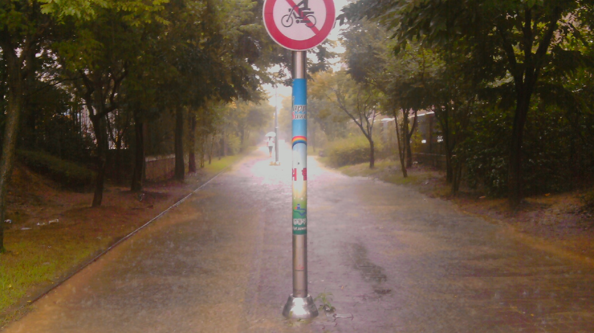
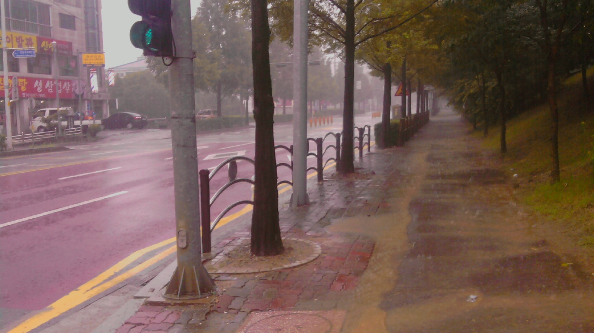

넋 놓고 비가 오는 날에는 전을 굽자.
===

|구분|내용| 
|---|---|
|날짜|2010년 8월 29일|
|주제|넋 놓고 비가 오는 날에는 전을 굽자| 
|테그|영통, 비오는 날, 2010년, 8월| 
|장소|경기도 수원시 영통구 영통동|

<!--P100829001.jpg-->

<!--P100829002.jpg-->

<!--P100829003.jpg-->

<!--P100829004.jpg-->

<!--P100829005.jpg-->

<!--P100829006.jpg-->

이 페이지는 로봇에 의해서 자동 생성되었습니다. 수정을 원하시면 아래의 링크를 이용해서 수정하시기 바랍니다. 
[✏️ ](https://www.github.com/boyinblue/boyinblue.github.com/edit/main/../901_diary/20100829_rainnyday/index.md '수정하기')
