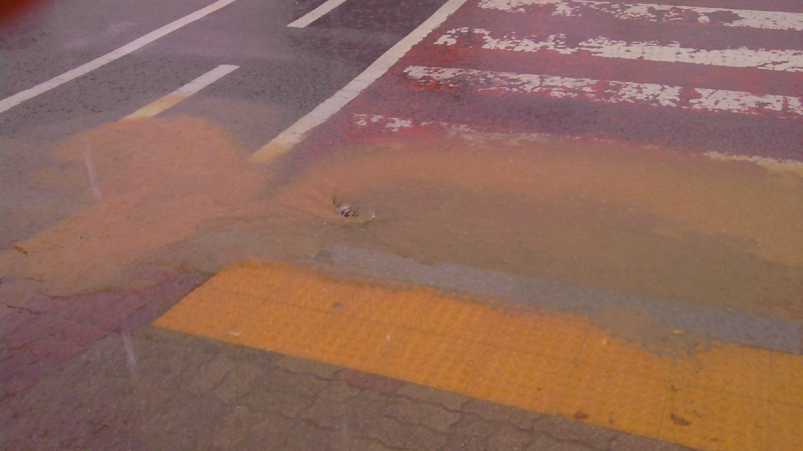
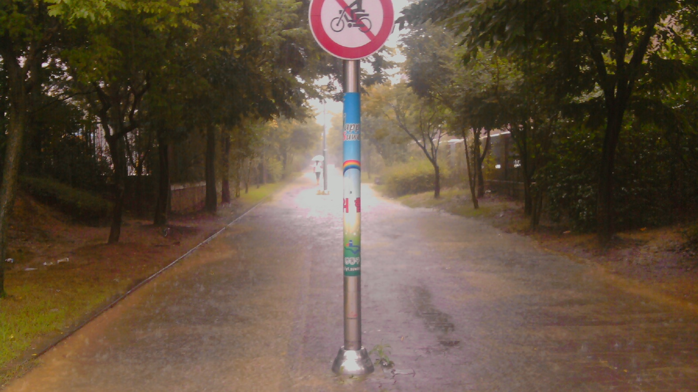
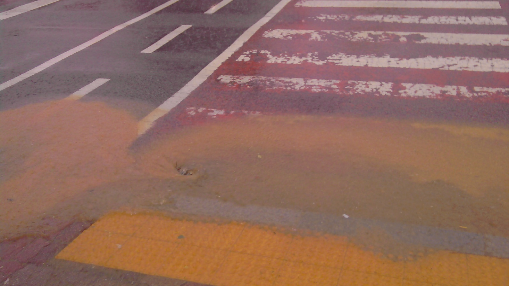
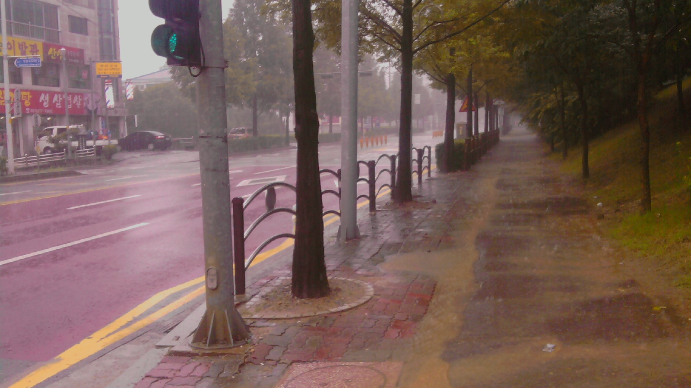
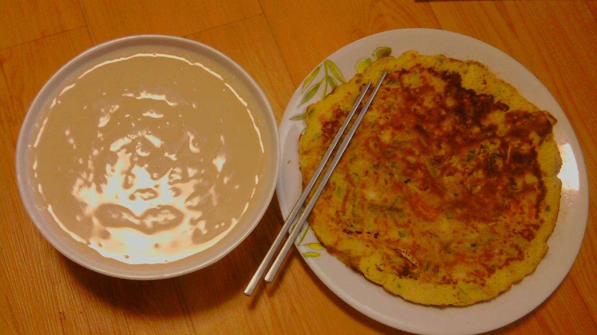

제목을 입력해주세요
===

|구분|내용|
|---|---|
|날짜|2022년 월 일|
|주제|(입력해주세요)|
|테그|(입력해주세요)|
|장소|(입력해주세요)|

/home/parksejin/project/boyinblue.github.io/assets/images/diary/20100829_rainnyday/P100829001.jpg

/home/parksejin/project/boyinblue.github.io/assets/images/diary/20100829_rainnyday/P100829002.jpg

/home/parksejin/project/boyinblue.github.io/assets/images/diary/20100829_rainnyday/P100829003.jpg

/home/parksejin/project/boyinblue.github.io/assets/images/diary/20100829_rainnyday/P100829004.jpg

/home/parksejin/project/boyinblue.github.io/assets/images/diary/20100829_rainnyday/P100829005.jpg

/home/parksejin/project/boyinblue.github.io/assets/images/diary/20100829_rainnyday/P100829006.jpg

