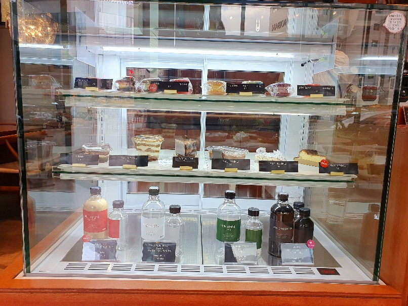
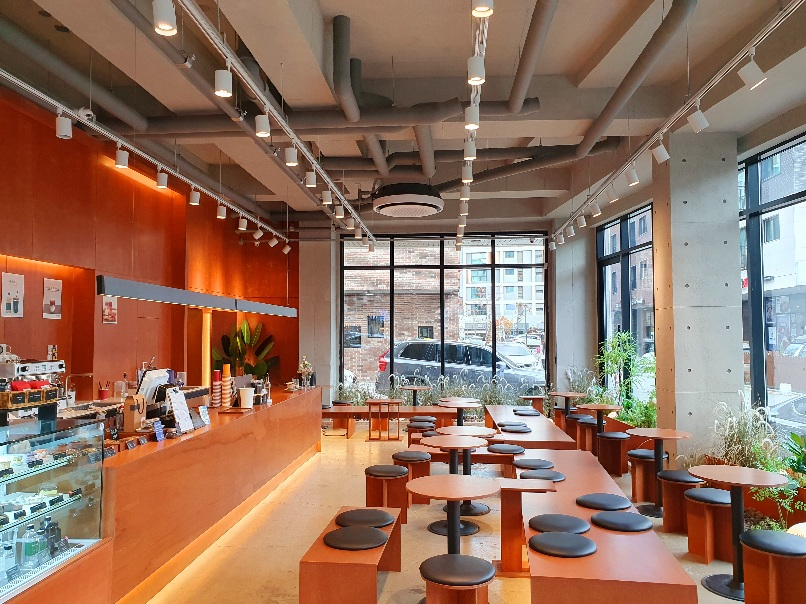
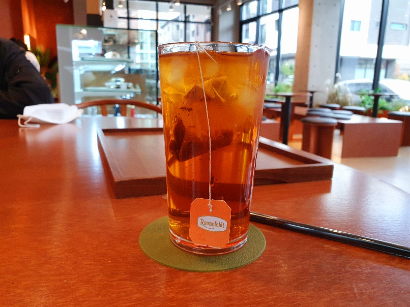
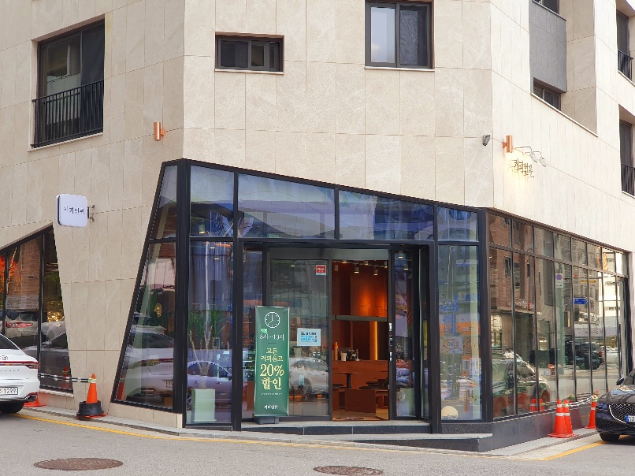
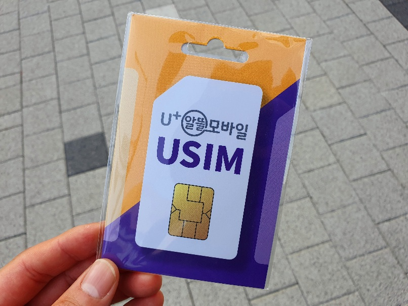
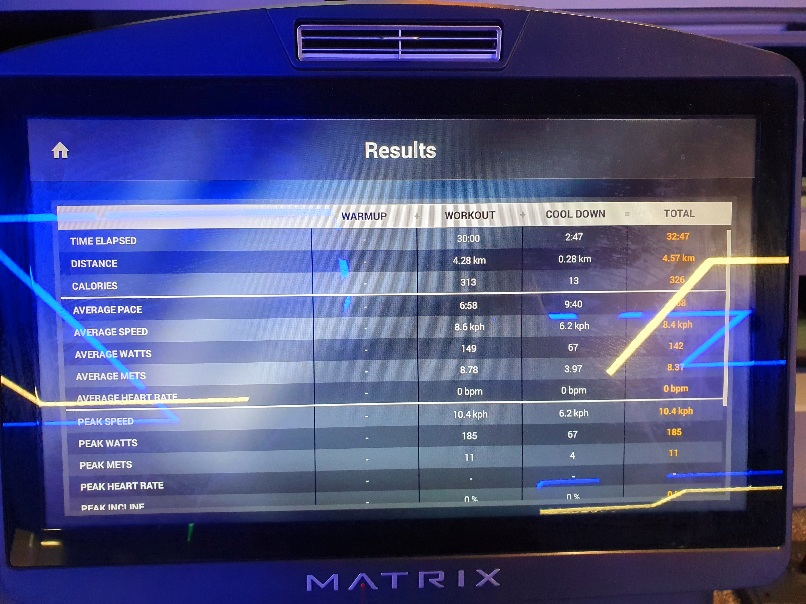

제목을 입력해주세요
===

|구분|내용|
|---|---|
|날짜|2022년 월 일|
|주제|(입력해주세요)|
|테그|(입력해주세요)|
|장소|(입력해주세요)|

/home/parksejin/project/boyinblue.github.io/assets/images/diary/20221031-uplus/20221031_142209-cafe-dessert.jpg

/home/parksejin/project/boyinblue.github.io/assets/images/diary/20221031-uplus/20221031_142224-cafe-interior.jpg

/home/parksejin/project/boyinblue.github.io/assets/images/diary/20221031-uplus/20221031_142718-cafe-louis-vosty.jpg

/home/parksejin/project/boyinblue.github.io/assets/images/diary/20221031-uplus/20221031_144730-cafe.jpg

/home/parksejin/project/boyinblue.github.io/assets/images/diary/20221031-uplus/20221031_154425-usim.jpg

/home/parksejin/project/boyinblue.github.io/assets/images/diary/20221031-uplus/20221031_181216-threadmill.jpg

/home/parksejin/project/boyinblue.github.io/assets/images/diary/20221031-uplus/4001614.jpeg

