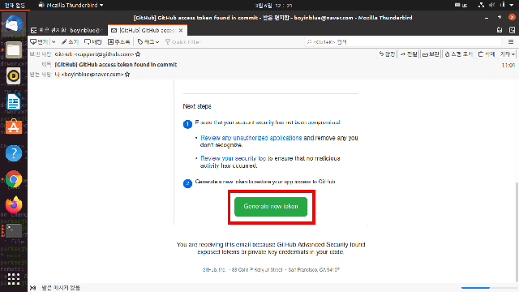
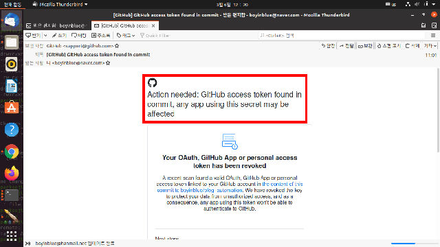
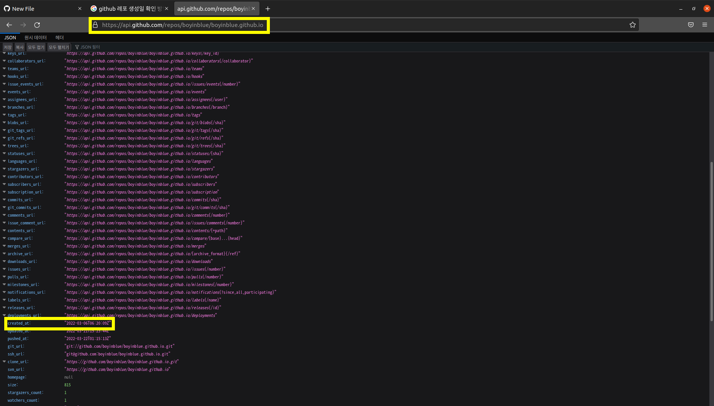

제목을 입력해주세요
===

|구분|내용|
|---|---|
|날짜|2022년 월 일|
|주제|(입력해주세요)|
|테그|(입력해주세요)|
|장소|(입력해주세요)|

/home/parksejin/project/boyinblue.github.io/assets/images/github-api/001_github-badcredential-regenerate-token.png

/home/parksejin/project/boyinblue.github.io/assets/images/github-api/001_github-badcredential-token-expire.png

/home/parksejin/project/boyinblue.github.io/assets/images/github-api/004-github-how-to-get-creation-date-of-repository.png

/home/parksejin/project/boyinblue.github.io/assets/images/github-api/logo.png

