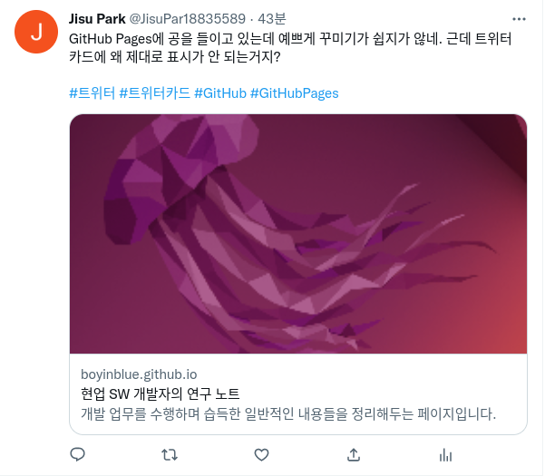

제목을 입력해주세요
===

|구분|내용|
|---|---|
|날짜|2022년 월 일|
|주제|(입력해주세요)|
|테그|(입력해주세요)|
|장소|(입력해주세요)|

/assets/images/github-pages/003_naver_search_console_register.png

/assets/images/github-pages/004_google_adsense_script_insert_position.png

/assets/images/github-pages/006-githubpages-not-support-php.png

/assets/images/github-pages/013-github-pages-deploy-error-400-502.png

/assets/images/github-pages/014-google-adsense-ads-txt-warning.png

/assets/images/github-pages/how-to-count-visitors-of-github-pages-with-hits-sh.png

/assets/images/github-pages/how-to-count-visitors-of-github-pages.png

/assets/images/github-pages/logo.png

/assets/images/github-pages/paginator-example.png

/assets/images/github-pages/twitter-card-validator-unable-to-render-card-preview.png

/assets/images/github-pages/twitter-card.png

/assets/images/github-pages/unable-to-tweet-with-github-pages.png

