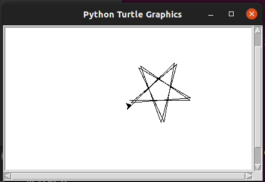
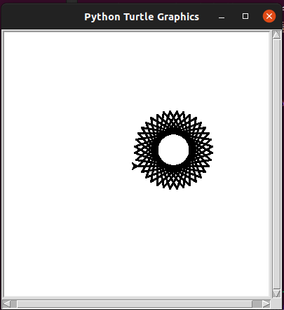
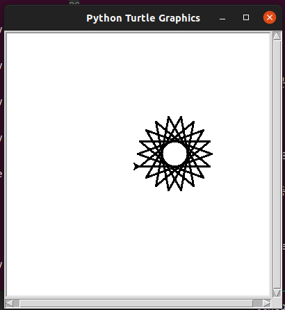
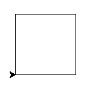
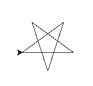
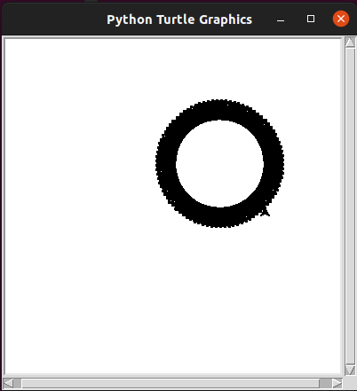
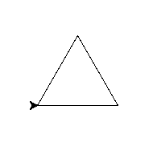
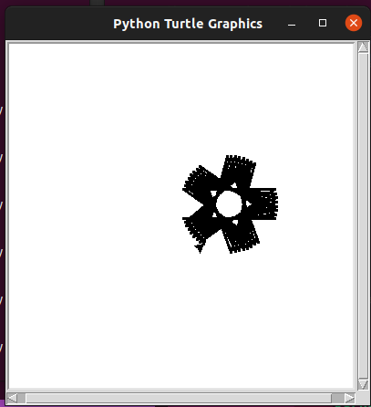

제목을 입력해주세요
===

|구분|내용|
|---|---|
|날짜|2022년 월 일|
|주제|(입력해주세요)|
|테그|(입력해주세요)|
|장소|(입력해주세요)|

/home/parksejin/project/boyinblue.github.io/assets/images/python/003-python-turtle-3d-start.png

/home/parksejin/project/boyinblue.github.io/assets/images/python/003-python-turtle-flower-36.png

/home/parksejin/project/boyinblue.github.io/assets/images/python/003-python-turtle-flower.png

/home/parksejin/project/boyinblue.github.io/assets/images/python/003-python-turtle-square.png

/home/parksejin/project/boyinblue.github.io/assets/images/python/003-python-turtle-start.png

/home/parksejin/project/boyinblue.github.io/assets/images/python/003-python-turtle-start2.png

/home/parksejin/project/boyinblue.github.io/assets/images/python/003-python-turtle-sun-10.png

/home/parksejin/project/boyinblue.github.io/assets/images/python/003-python-turtle-tier.png

/home/parksejin/project/boyinblue.github.io/assets/images/python/003-python-turtle-triangle.png

/home/parksejin/project/boyinblue.github.io/assets/images/python/003-python-turtle-wheel.png

/home/parksejin/project/boyinblue.github.io/assets/images/python/logo.png

