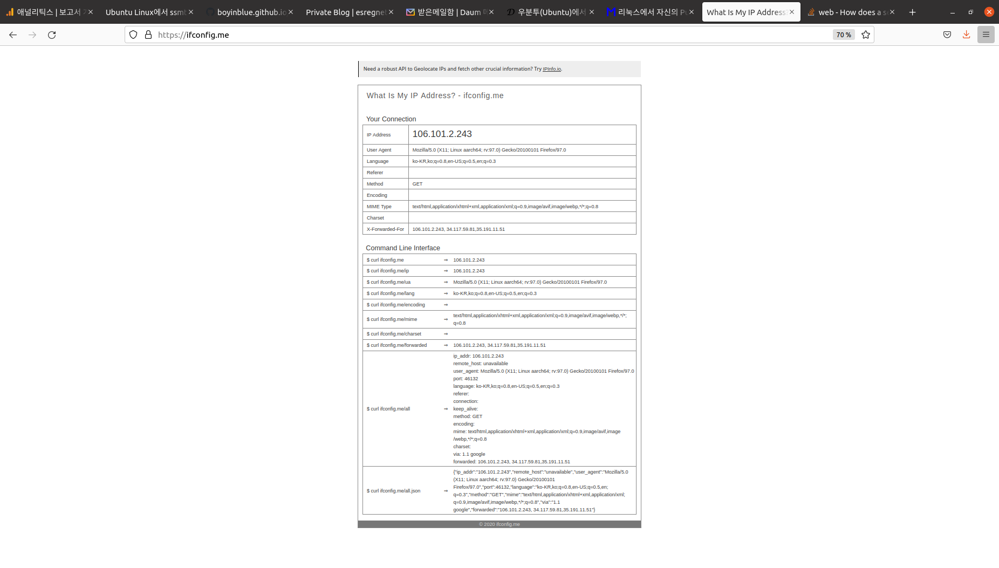

제목을 입력해주세요
===

|구분|내용|
|---|---|
|날짜|2022년 월 일|
|주제|(입력해주세요)|
|테그|(입력해주세요)|
|장소|(입력해주세요)|

/home/parksejin/project/boyinblue.github.io/assets/images/ubuntu/002-how-to-get-public-ip.png

/home/parksejin/project/boyinblue.github.io/assets/images/ubuntu/logo.png

/home/parksejin/project/boyinblue.github.io/assets/images/ubuntu/ubuntu-linux-special-characters.png

