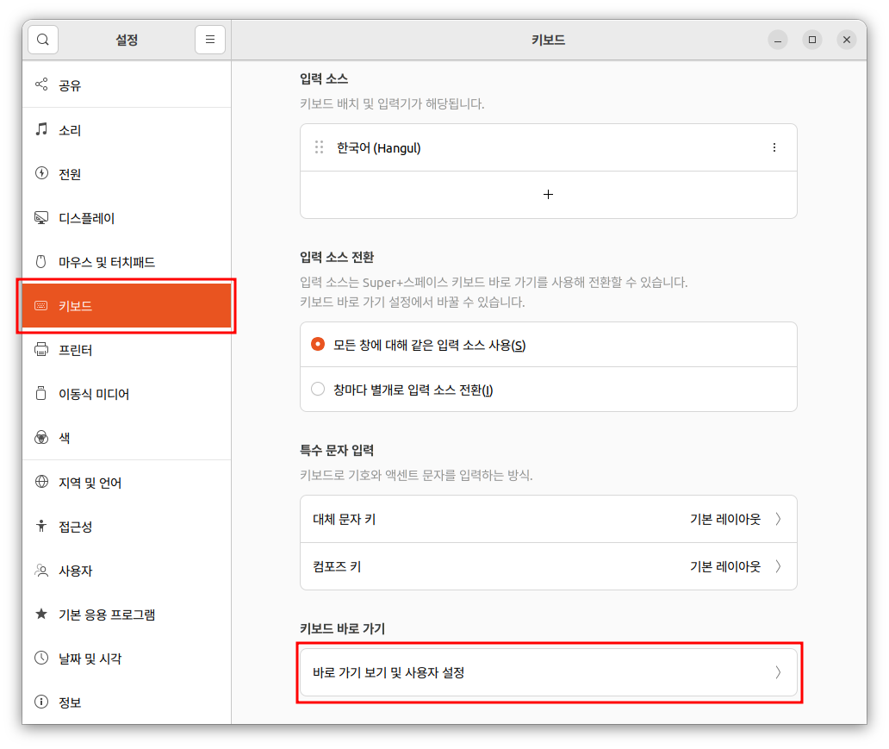
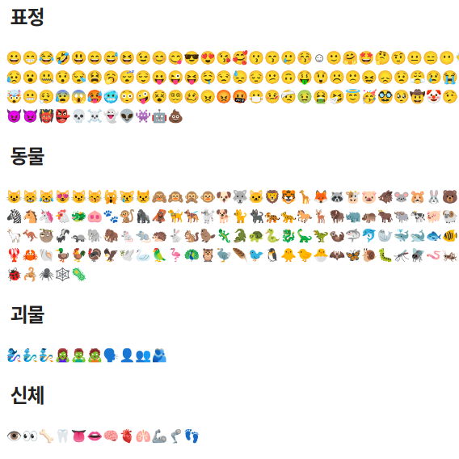

제목을 입력해주세요
===

|구분|내용|
|---|---|
|날짜|2022년 월 일|
|주제|(입력해주세요)|
|테그|(입력해주세요)|
|장소|(입력해주세요)|

/assets/images/ubuntu/002-how-to-get-public-ip.png

/assets/images/ubuntu/logo.png

/assets/images/ubuntu/ubuntu-linux-short-cut-execute-2.png

/assets/images/ubuntu/ubuntu-linux-short-cut-execute-3.png

/assets/images/ubuntu/ubuntu-linux-short-cut-execute-4.png

/assets/images/ubuntu/ubuntu-linux-short-cut-execute-5.png

/assets/images/ubuntu/ubuntu-linux-short-cut-execute-6.png

/assets/images/ubuntu/ubuntu-linux-short-cut-execute-7.png

/assets/images/ubuntu/ubuntu-linux-short-cut-execute.png

/assets/images/ubuntu/ubuntu-linux-special-characters.png

